# AWS S3 Bucket Creation & IAM Access Logging
*AWS Cloud Security – Lab Documentation*

---

## 1. Overview

**Goal:** Set up an Amazon S3 bucket, configure access permissions for an IAM user, attempt to download files from the bucket, and capture/analyze the resulting access logs.

**What I learnt:**
- Creating and configuring Amazon S3 buckets
- Managing IAM user permissions and policies (Least Privilege)
- Configuring S3 server access logging / AWS Cloud Watch
- Monitoring and analyzing access log entries for read/download attempts

---

## 2. Architecture & Components

- **Amazon S3**: Object storage holding sensitive test data/files.
- **AWS IAM**: User identity and policy definition governing access to the S3 bucket.
- **Logging Service**: S3 Server Access Logging / AWS Cloud Watch logging API calls and data access events.

---

## 3. Tools & Services Used

- AWS Management Console / AWS CLI
- Amazon Simple Storage Service (S3)
- AWS Identity & Access Management (IAM)
- AWS Amazon CloudWatch (or S3 Access Logs)

---

## 4. Step-by-Step Implementation

### 4.1 Creating the S3 Buckets
1. I first created an AWS account as I did not have one.

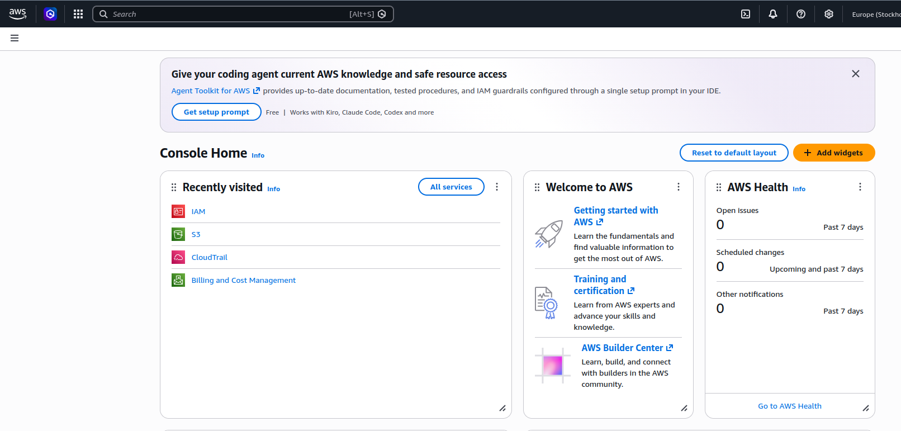

2. I then navigated to the s3 page and made a bucket. I also configured the bucket settings (Region, Block Public Access settings, Encryption).

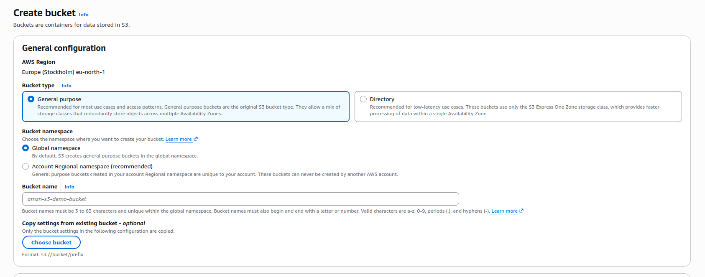

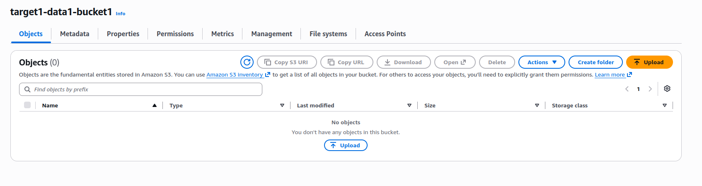

3. I then also created a second bucket to recieve all the events that were happening and log them.

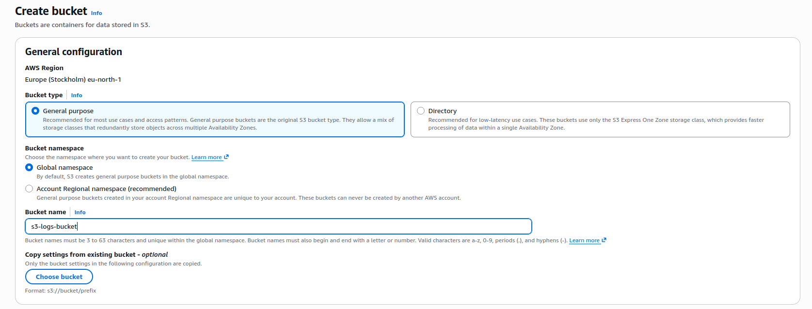

4. After creating this bucket I then enabled something called server access logs, directing them to a logs folder allowing me to view everything that happened.

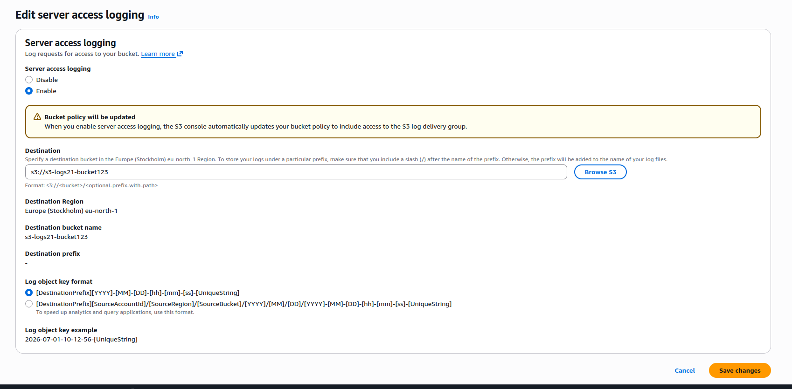

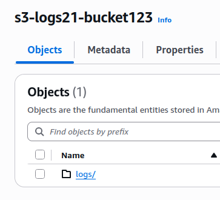

---

### 4.2 Uploading sensitive test file

1. I made a simple .txt file and then uploaded it to the bucket I just made as a target to try and download.

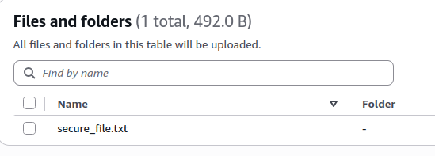

---

### 4.3 Viewing s3 server access logs

1. The first thing I did was send off a request to list the file and wait about 10 minutes for the server logs to update.

```aws s3 ls s3://target1-data1-bucket1/ --region eu-north-1```

- I set the region to eu-north-1 as that was where the bucket was located.

2. The logs folder was then updated.

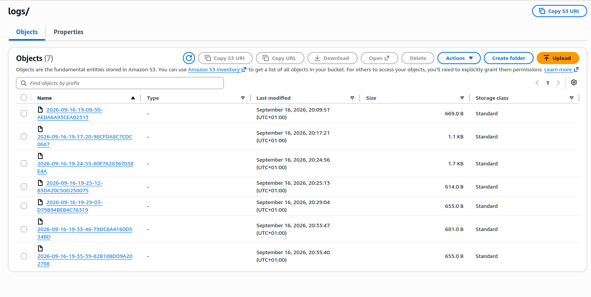

3. After opening one of the logs I was greeted with a load of json that was honestly really hard to understand what was going on so I researched a better way to view logs and landed on creating a cloud watch and pointed it at the s3 bucket with the sensitive file in it.

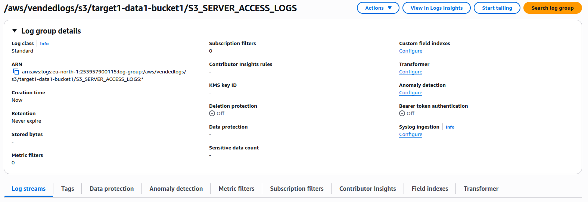

4. To use this I had to create an iam user and generate an access key to act as that user through my terminal.
   - I also put a read only policy on the user as seen in the image below.

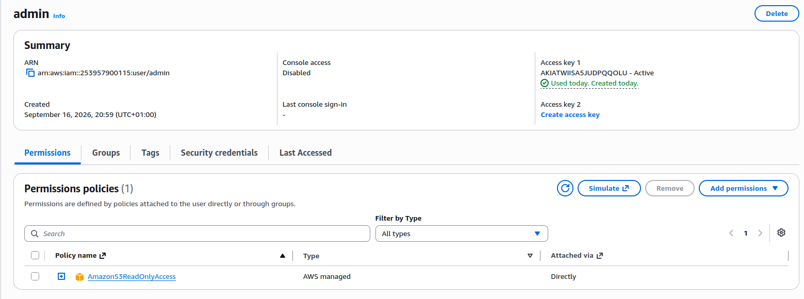


---


## 5. Testing & Access Logging

### 5.1 Attempting to Download the File as IAM User
1. I authenticated as the IAM user via the AWS CLI.
2. I then attempted to access/download the file from the S3 bucket:

```bash
aws s3 cp s3://target1-data1-bucket1/secure_file.txt --region eu-north-1
```
---

### 5.2 Analyzing the Generated Logs
1. I inspected the log records generated by the download request.

2. Using the CloudWatch Logs insights query language I requested to see the events (However I did use ai to help me with generating this query as I did not know how to do it).

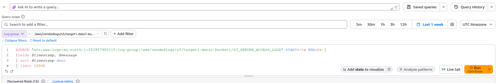

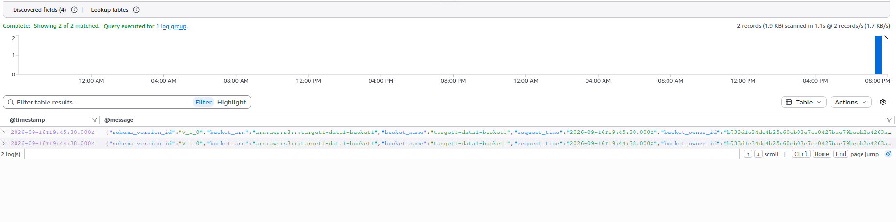

3. As you can see using this method has made viewing these logs and their content so much easier therefore improving my user experience.

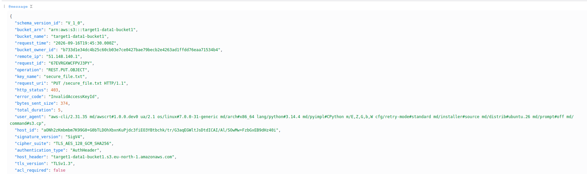

---

## 6. Conclusion

1. In conclusion I think this hands on project was a great introduction into the basics of AWS and Cloud security. It was interesting messing around with the different IAM user policies and permissions and figuring out how to view the logs in a more reasonable way than a block of json code. In the future I think I would like to carry out a controlled attack against a bucket or different type of storage and see what alerts pop up and how I would be able to fix them. So overall, I think this has been a great learning experience. I also deleted evereything afterward to maintain a no-cost environment.
