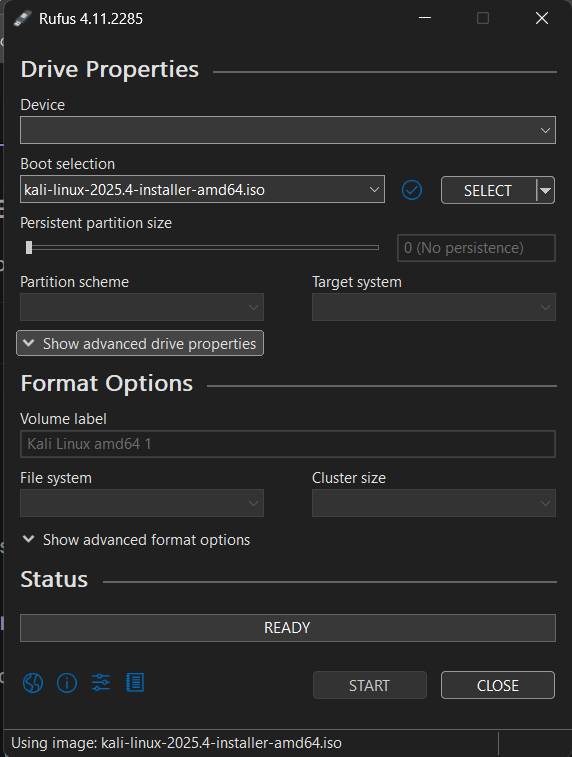
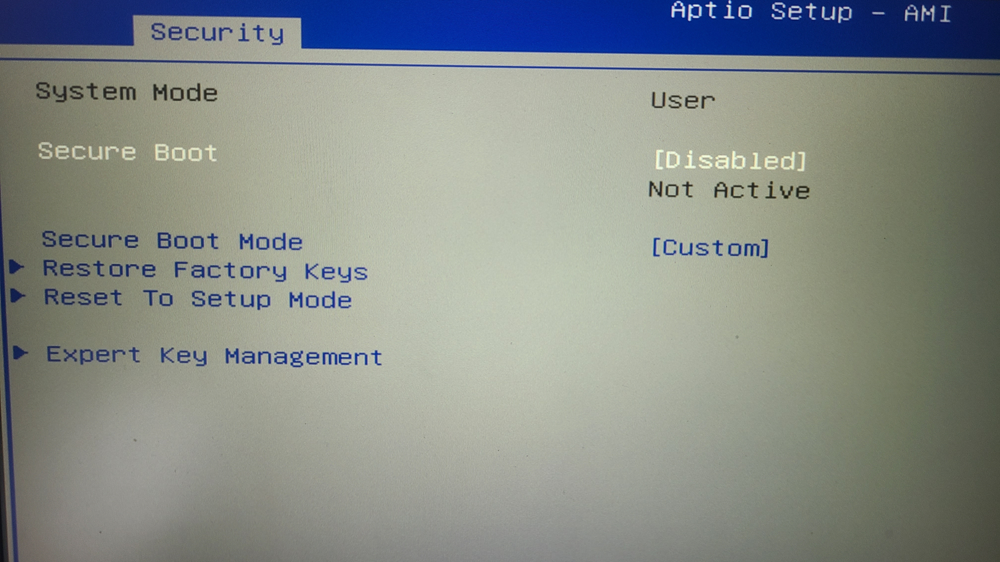

# Dual‑Booting Kali Linux on my Windows 11 laptop

## 1. Overview

**Goal:** Install Kali Linux alongside Windows 11 in a dual‑boot configuration.   
**What I learnt:**
- Disk partitioning
- BIOS/UEFI configuration
- Bootloader setup
- Installing Kali safely without overwriting Windows

---

## 2. System Requirements

- Windows 11 already installed
- At least 30–60 GB free disk space
- USB drive (8 GB+)
- UEFI firmware (most modern laptops)
- Secure Boot toggle available in BIOS

---

## 3. Preparing Windows 11

### 3.1 Back up important data
I first prepared my laptop in case anything went wrong by moving all the folders and files I wanted into my one drive folder and making sure everything was safely and fully backed up

### 3.2 Shrink the Windows partition
I used the Disk Management tool:
- Open `diskmgmt.msc` (Or you can right click on the windows icon and press the disk management option)
- I then right clicked on my windows partition and selected shrink volume
- I left 80gb of unallocated space

---

## 4. Creating the Kali Bootable USB

### 4.1 Download Kali ISO
https://www.kali.org/get-kali/#kali-installer-images

### 4.2 Flash the USB with Rufus
I used rufus to flash the kali iso image onto my usb stick:

---

## 5. Configuring BIOS/UEFI

### 5.1 Enter BIOS
Some common keys to enter bios are (F2, F10, DEL), However I used the DEL key.

### 5.2 Disable Secure Boot
I then also disabled secure boot on my laptop within the bios settings:

### 5.3 Change boot order
Set USB first.

---

## 6. Installing Kali Linux

### 6.1 Boot from USB
You can hold down shift and press restart. You can then press the choose devices option and boot into the usb you have plugged in.

### 6.2 Start the installer
Choose “Graphical Install”.

### 6.3 Partitioning
Choose:
- Use the largest unallocated space

---

## 7. First Boot After Installation

### 7.1 kali management page appears
You can choose whether you want to boot into kali or windows 11

### 7.2 Boot into Kali
Confirm installation.

### 7.3 Boot into Windows
Verify Windows still works.

---

## 8. Troubleshooting

- GRUB not showing
- Windows bootloader overwriting GRUB
- Secure Boot issues
- Windows not working - (For the first time booting back into windows you may need to use a bitlocker key to access it)

---

## 9. Conclusion

Overall this was a new but fun learning expereince for me and I achieved:
- Dual‑boot setup
- Both OSes working
- GRUB managing the boot process

