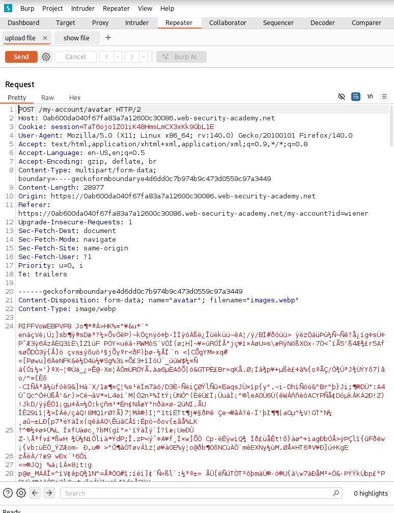
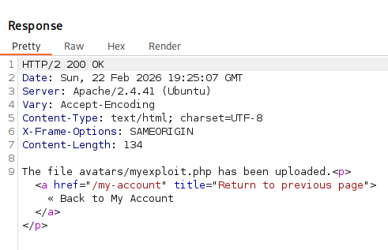
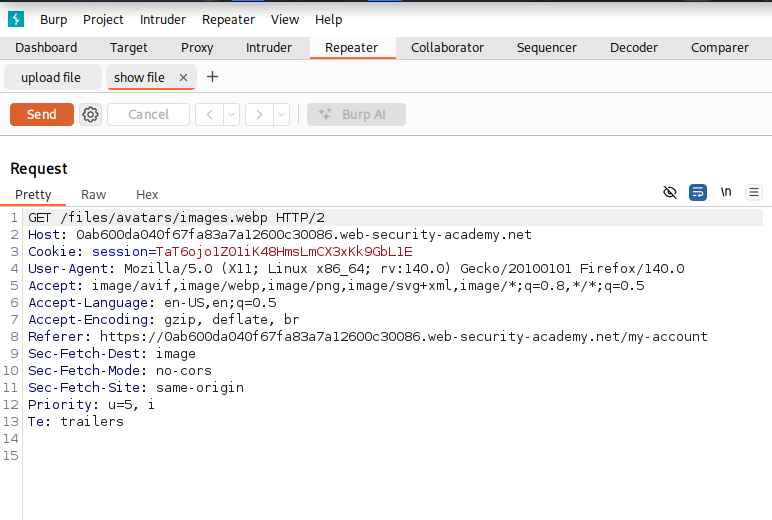
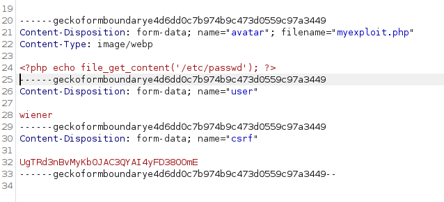
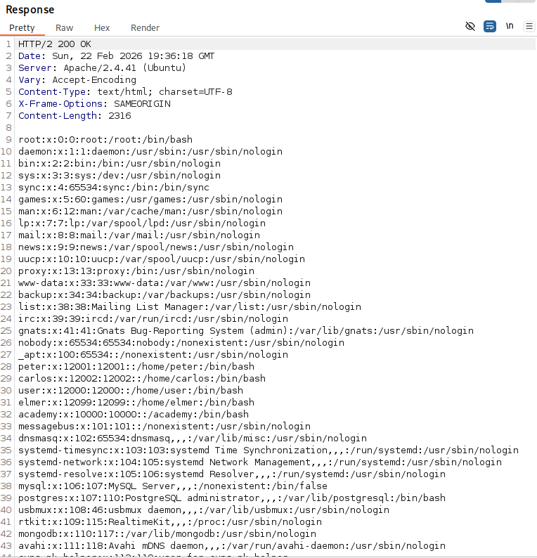
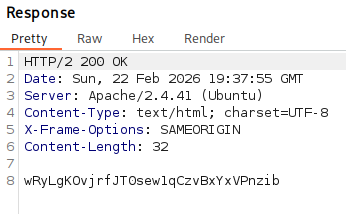
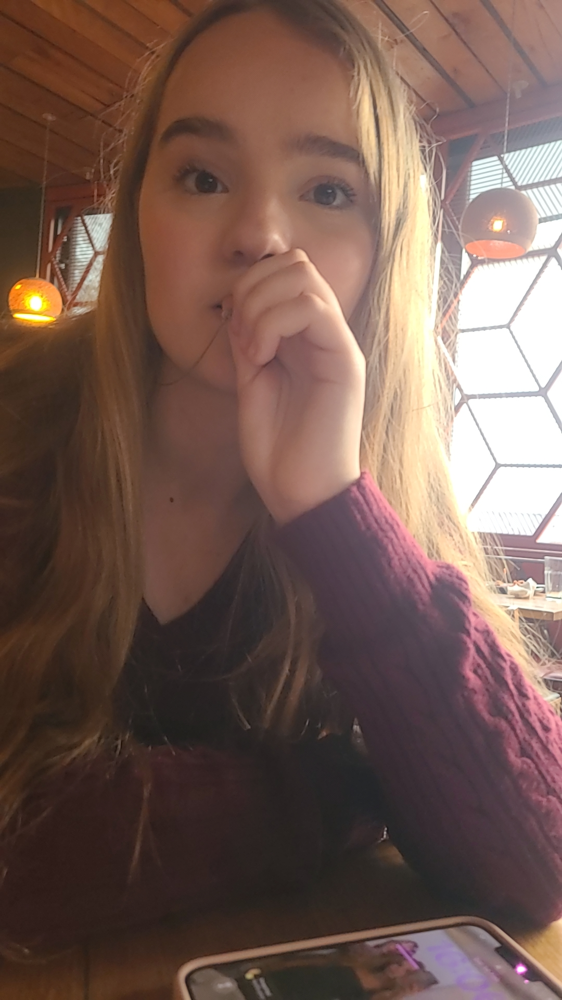

# Remote Code Execution via Web Shell Upload
*PortSwigger Academy – Lab Documentation*

## 1. Overview
This lab demonstrates how insecure file upload functionality can lead to remote code execution (RCE). The website allows users to import an avatar for their account and this is the area we are going to try and exploit

## 2. Learning Objectives
- Understand insecure file upload vulnerabilities      
- Upload a malicious script file  
- Understand the response 

## 3. Tools used
- Burp suite

## 4. Recon & Initial Observations
During initial exploration of the site:
- logged in using the given credentials
- The webiste provides an image upload feature 
- looked at the POST and GET requests through the burp suite proxy tab    

## 5. Attack Strategy
1. Intercept the upload request using Burp Suite:  



result:



2. As well as intercept the GET request:



3. I Modified the filename to use the script extension `.php` and used a simple web shell:



4. I then changed the GET request to myexploit.php and got the result i wanted:



5. I then switched out the payload to find carlos's secret key which is what the lab requested

## 6. Payload Used

```<?php echo file_get_contents('/home/carlos/secret'); ?>```

- I then got the secret key i was looking for:



## 7. Conclusion

This lab highlights how insecure file upload functionality can lead compromise in the website. By bypassing weak validation and uploading a web shell, an attacker can veiw files and pages that he wouldn't be able to veiw as a normal user.


