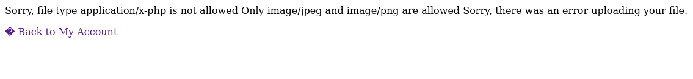

# Web shell upload via Content-Type restriction bypass
*Portswigger Academy - Lab documentation*

## 1. Overview
This lab contains a vulnerable image upload function. It attempts to prevent users from uploading unexpected file types, but relies on checking user-controllable input to verify this. 

## 2. Learning Objectives
- Objective 1
- Objective 2
- Objective 3

## 3. Tools Used
- Burp Suite

## 4. Reconnaissance & Initial Observations/plan

- I loaded up the lab and logged into an account using given credentials
- I then saw the upload feature so i loaded up Burp Suite to have a look at it.

## 5. Execution

- tried to upload a php shell file I already had which had the contents of ```<?php system($_REQUEST['cmd']); ?>```


- It then blocked me as it didn't allow for the php file type to be uploaded



- What weaknesses you identified
- How you planned to exploit them

*(Keep this high‑level and non‑harmful.)*


## 6. Key Findings
- What the vulnerability allowed
- Why the application was exposed
- What data or behaviour was demonstrated in the lab

## 9. Mitigation Recommendations
- Proper server-side validation
- Strong file-type enforcement
- Secure storage locations
- Least-privilege access controls
- Logging and monitoring

## 10. Conclusion
Summarise what the lab demonstrated, what you learned, and why the vulnerability matters in real-world applications.

## 11. Appendix (Optional)
- Extra screenshots
- Notes
- References
