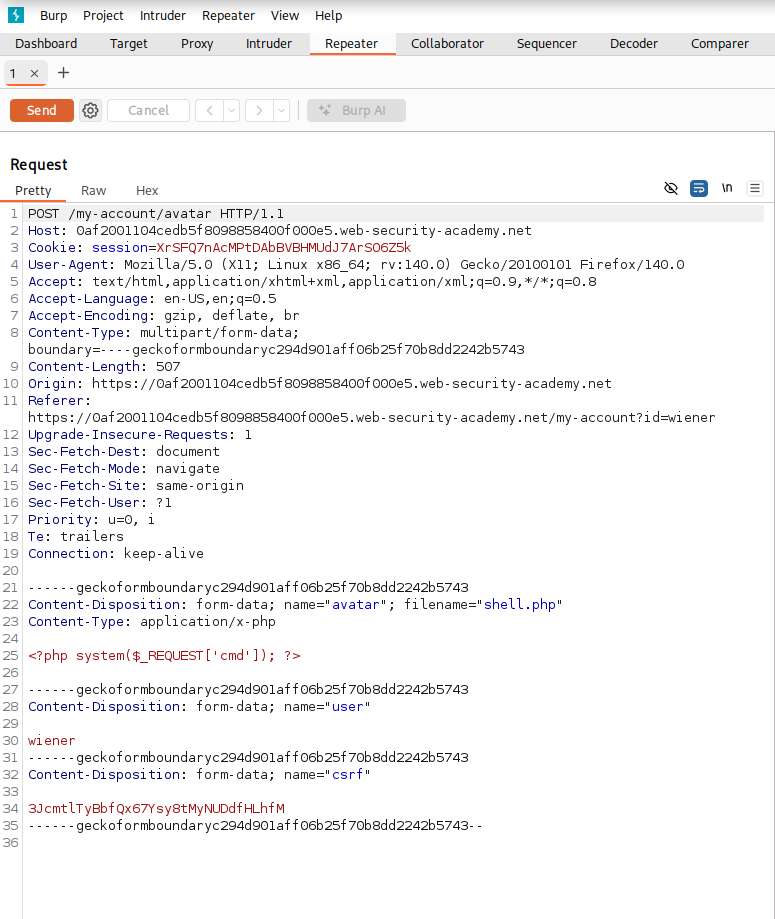
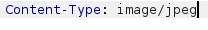
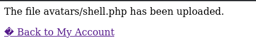
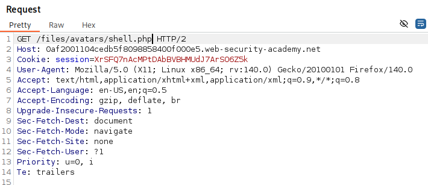
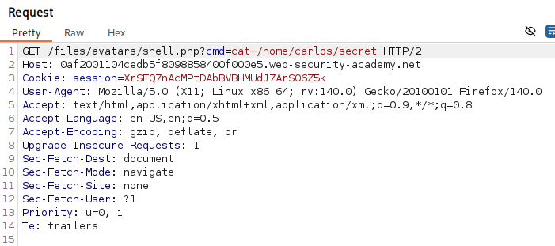
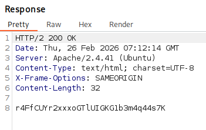

# Web shell upload via Content-Type restriction bypass
*Portswigger Academy - Lab documentation*

## 1. Overview
This lab contains a vulnerable image upload function. It attempts to prevent users from uploading unexpected file types, but relies on checking user-controllable input to verify this. 

## 2. Learning Objectives
- Understand how insecure file upload mechanisms can be abused when servers rely on weak or client‑controlled validation such as the Content-Type header.

- Identify how improper handling of uploaded files can lead to remote code execution when files are stored in executable directories.

- Analyze HTTP requests and responses to spot weaknesses in upload workflows, including how metadata manipulation can bypass intended restrictions.


## 3. Tools Used
- Burp Suite

## 4. Reconnaissance & Initial Observations/plan

- I loaded up the lab and logged into an account using given credentials
- I then saw the upload feature so i loaded up Burp Suite to have a look at it.

## 5. Execution

- tried to upload a php shell file I already had which had the contents of ```<?php system($_REQUEST['cmd']); ?>```


- It then blocked me as it didn't allow for the php file type to be uploaded


- I then used Burp Suite to examine the POST request of the php file upload:



- I then could just edit the content type header as it trusted user-controlled meta-data:



- As a result of this the php file could then be uploaded to the server successfully:



- I then saw the GET request for the file which also showed me where they stored it which is another flaw that you shouldn't allow users to be able to see:



- Now that the file is uploaded I can then modify the GET request and use the cmd function to list the contents of ```/home/carlos/secret```



- Once that request was sent I could then veiw the contents of the file/folder I was trying to view:



## 6. Key Findings

### 6.1 What the vulnerability allowed

- The file upload feature had a flaw that let someone upload a file the server would actually execute, instead of simply treating it like a normal image. Because the server trusted the Content-Type Header without actually checking the type of image and saved uploaded files in a location where code could be executed, an attacker could sneak in malicious server-side code and then activate it through modifying regular browser request, and could then potentially access unauthorised files or folders.

### 6.2 Why the application was exposed

- It relied on client‑controlled metadata (Content-Type) instead of validating the actual file content.

- It did not enforce strict file extension or MIME‑type checks.

- Uploaded files were stored in a web‑accessible directory where the server executed them.

- There were no safeguards such as content inspection or execution restrictions on the upload directory.

## 7. Mitigation Recommendations

- Proper server-side validation
- Strong file-type enforcement
- Secure storage locations
- Least-privilege access controls
- Logging and monitoring

## 8. Conclusion

- Overall this was an educational lab which helped me understand how important it is to not allow users to access important meta data and to make sure to validate content-type data and teaching me how to bypass it.