# Web shell upload via extension blacklist bypass
*Portswigger academy - lab*

## 1. Overview
This lab contains a vulnerable image upload function. Certain file extensions are blacklisted, but this defense can be bypassed due to a fundamental flaw in the configuration of this blacklist. 

## 2. Learning Objectives
- Learn how to move around a blacklist
- Remind myself of the basic php shell and how to use it

## 3. Tools Used
- Burp suite
- PHP

## 4. Reconnaissance & Initial Observations
- I opened up the lab as well as Burp Suite and set my foxy proxy up for Burp Suite
- I then saw that the website had an image upload function so I tried to upload my php web shell:

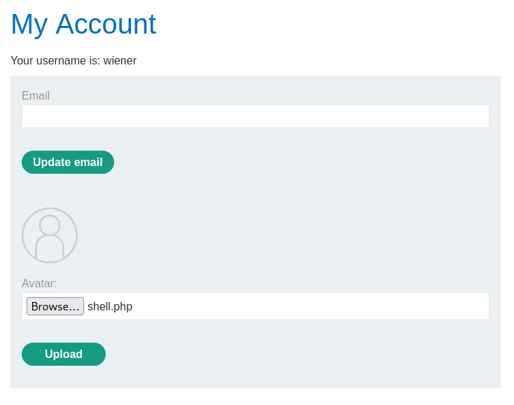

- It then rejected the upload as php files weren't allowed:

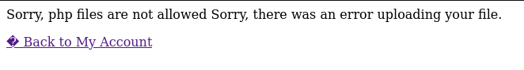

- I then used Burp Suite to view both the POST request and response:

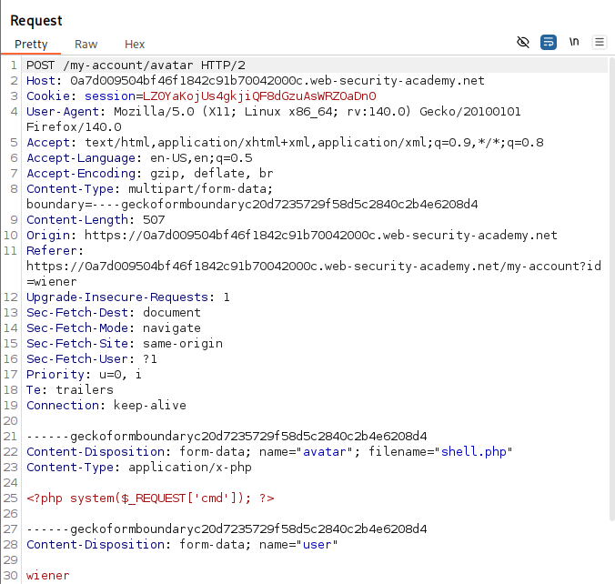

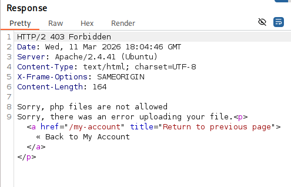

## 5. Execution
- I went back to the POST request and edited it to hopefully allow me to bypass the blacklist:

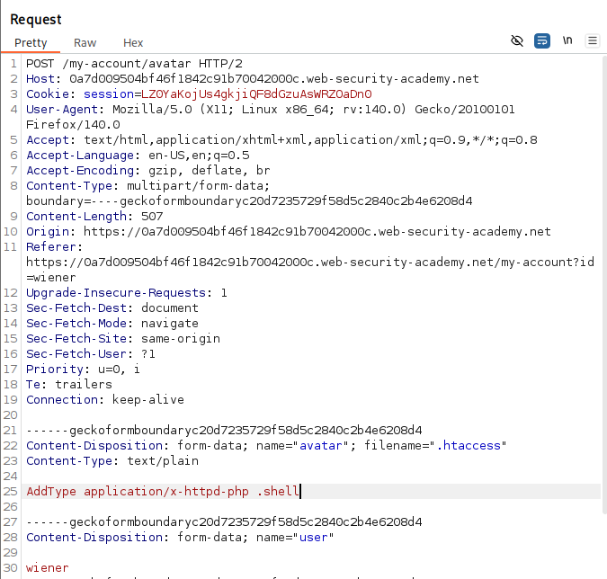

### 5.1 Filename
- I uploaded a file named ```.htaccess```, which is a configuration file used by Apache web servers.
- This is powerful beacause ```.htaccess``` can override server settings for the directory it’s placed in.
- My goal: Trick the server into treating files with a .shell extension as PHP scripts.

### 5.2 Content-Type
- I declared the file as text/plain, which is a non-executable MIME type.
- This matters because Some servers validate uploads based on MIME type. By using text/plain, you may bypass filters that block application/x-httpd-php or other executable types.
- However the real payload is inside the file content, not the MIME type.

### 5.3 File content
- ```AddType application/x-httpd-php .shell```
- What this does: Tells Apache to treat .shell files as PHP scripts.
- Why it’s dangerous: If the server honors this .htaccess file and I later upload a file like exploit.shell, it could be executed as PHP — giving you remote code execution.

### 5.4 Response
- I sen the request and it came back as 200 OK:

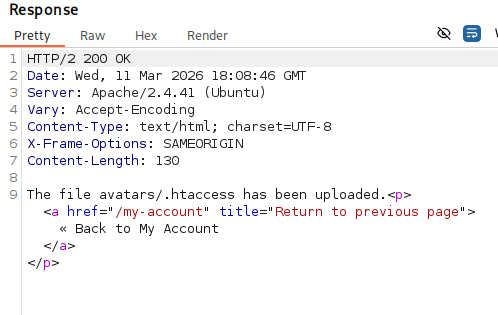

- I then went back to the original POST request and changed the file name to end in ```.shell```:

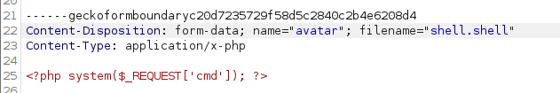

- I then sent that request and it now came back with a 200 OK:

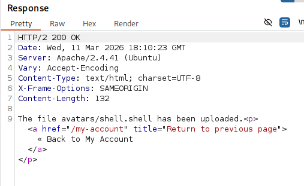

- I then went back to the website and opened the uploded shell into a new page:

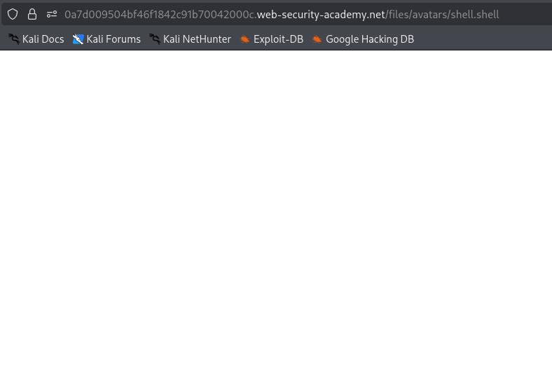

- From there i could then activate the shell by changing the last part of the URL therefore exposing the secret:

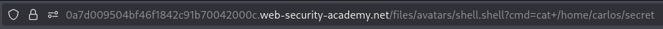

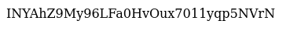


## 9. Conclusion
Overall I enjoyed this lab and it showed me that just because there are blacklists on your website doesn't mean that it is still safe.

