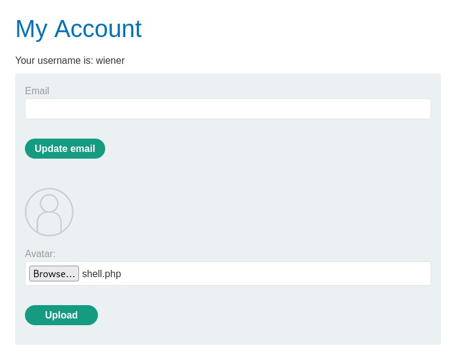
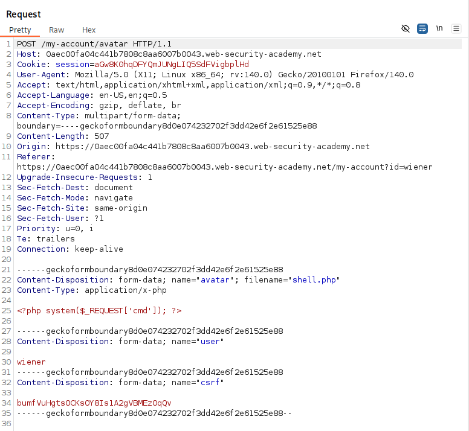
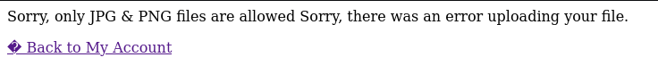
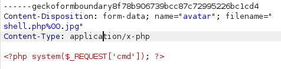
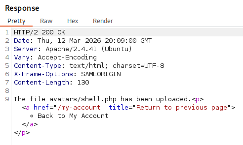
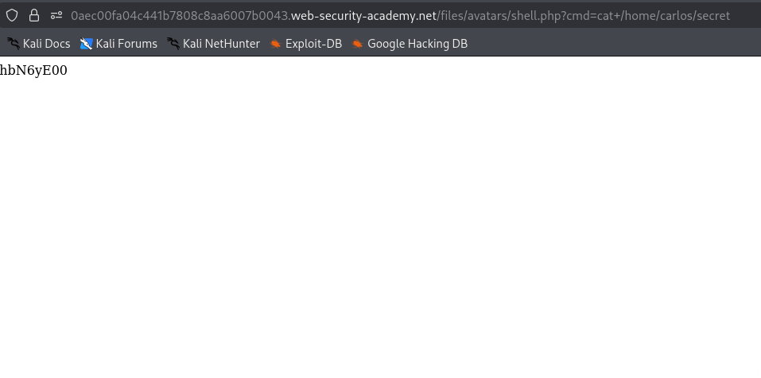

# Web shell upload via obfuscated file extension
*Portswigger academy - lab*

## 1. Overview
This lab contains a vulnerable image upload function. Certain file extensions are blacklisted, but this defense can be bypassed using a classic obfuscation technique.

## 2. Learning Objectives
- How I can change the file ending to help bypass a blacklist

## 3. Tools Used
- Burp Suite

## 4. Reconnaissance & Initial Observations
- I started up the lab and navigated my way over to the file upload feature of the website and tried to upload my php shell:



- I also had Burp Suite monitoring this request so I viewed the POST request:



- It wouldn't allow me to upload the file because it was blocked:



## 5. Execution
- I changed the filename of the POST request to ```shell.php%00.jpg```:



- The %00 is a null byte, which means:
- Everything after %00 is ignored by the server
- Everything before %00 is treated as the real filename

- So the server thinks:

- Validation layer: “This ends in .jpg, looks safe.”

- Execution layer: “This is actually a .php file, I’ll execute it.”

- This leads to remote code execution with the file containing PHP code.

- We can see that the reponse of this is a 200 OK which means that the file got uploaded successfully:



I then opened up the uploaded 'image' on a new page and at the end of the url entered the simple command code to put the shell into use and find out the secret we needed to find:



## 9. Conclusion
This lab was great as it help me to learn another way on how to bypass a blacklist.

