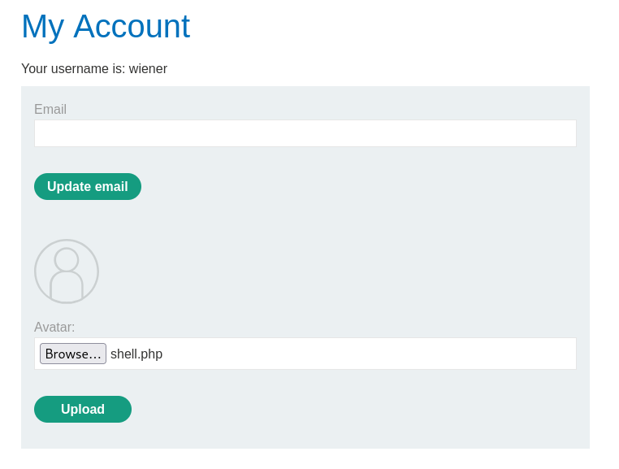
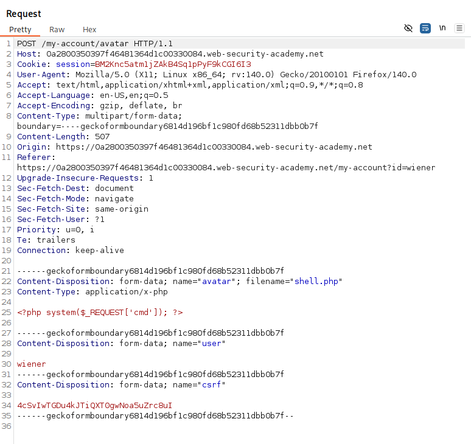
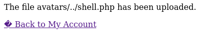
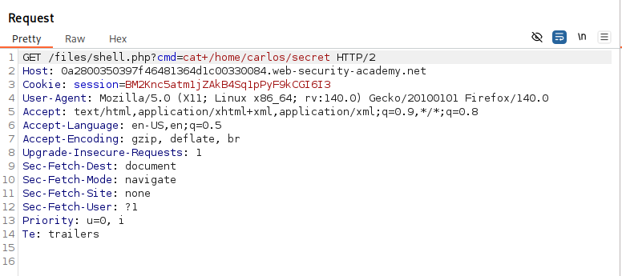
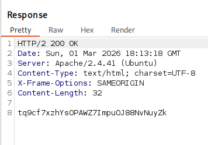

# Web shell upload via path traversal
*Portswigger Academy*

## 1. Overview
This lab contains a vulnerable image upload function. The server is configured to prevent execution of user-supplied files, but this restriction can be bypassed by exploiting a secondary vulnerability. 

## 2. Learning Objectives
- Understand directory traversal sequences
- Understand how to decode/encode URL
- Understand how to navigate through directories

## 3. Tools Used
- Burp Suite
- URL encoder/decoder 

## 4. Reconnaissance & Initial Observations
Describe:
- The application includes an image upload feature intended for user avatars or similar content.
- Uploaded files are stored in a predictable directory such as /images/ or /files/.
- It accepts common traverseries such as ../

## 5. Attack Strategy
- The first thing I did was to upload my php shell with the upload feature:



- I then opened Burp Suite and had a look at the POST request:



- I used an online url encoder to encode the command ```../``` and then entered it into my POST request:


- I then saw that it had uploaded with ```../``` which was a very good sign:



- I then viewed the GET request and used the cmd command to access the secret file in /files:



- I sent the request and it worked:



## 6. Execution (High-Level)
Document the steps you took conceptually:
- What you modified
- How the server responded
- How you confirmed the vulnerability
- Any required output the lab asked for

## 7. Key Findings
- What the vulnerability allowed
- Why the application was exposed
- What data or behaviour was demonstrated in the lab

## 8. Mitigation Recommendations
- Proper server-side validation
- Strong file-type enforcement
- Secure storage locations
- Least-privilege access controls
- Logging and monitoring

## 9. Conclusion
Summarise what the lab demonstrated, what you learned, and why the vulnerability matters in real-world applications.

## 10. Appendix (Optional)
- Extra screenshots
- Notes
- References
