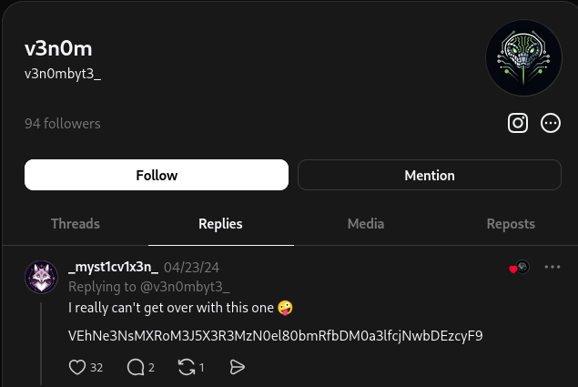
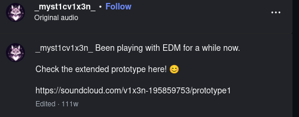
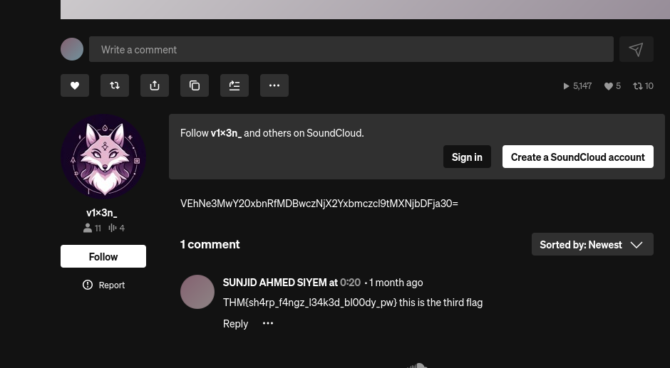
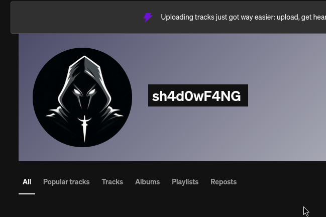
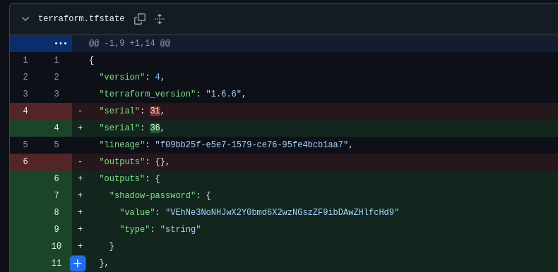

# Operation Slither

## 1. Goal
- The objective was to start from the given username and find other accounts and flags from that username using OSINT and various linux resources.

---

## 2. What I Learned
- How to be more perceptive and find other accounts on that username 
- Always look at the comments of posts to help you.
- How to recognise if something is base64.
- How to avoid false positives and stay focused.   

---

## 3. Key Observations
- Not everything is a solid lead, it could just lead you down a rabbit hole.
- An important thing to note down is that some platforms return false positives.
- Comments and followers often reveal secondary accounts

---

## 4. Commands / Scripts Used
```
# echo VEhNe3NoNHJwX2Y0bmd6X2wzNGszZF9ibDAwZHlfcHd9 | base64 -d
```

---

## 5. Tools used
- Sherlock (Initial username sweep)
- Manual OSINT
- Decoding base64 in linux cli

---

## 6. Screenshots

- Looking at the comment on the usernames account found me the flag.


- I found the person who commented the flags instagram and saw they had a soundcloud account.


- I found the second flag by looking at their comments.


- I found a suspicious account by looking at their followers and found out that the account had a github


- I looked within their commits and found a value that looked like base64 and it was the last flag.
---

## 7. Summary
- I enjoyed this room and think it went well by teaching me how to recognise base64 and use OSINT more efficiently which will help me in the future. I think I need to improve on searching through results and comments more quickly but overall found it very fun
