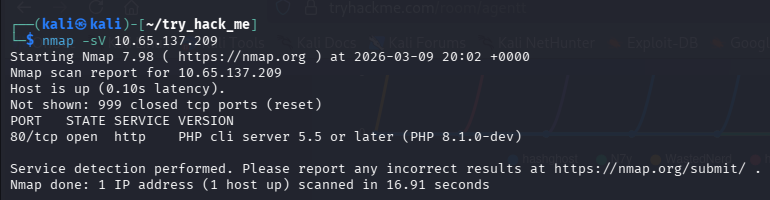
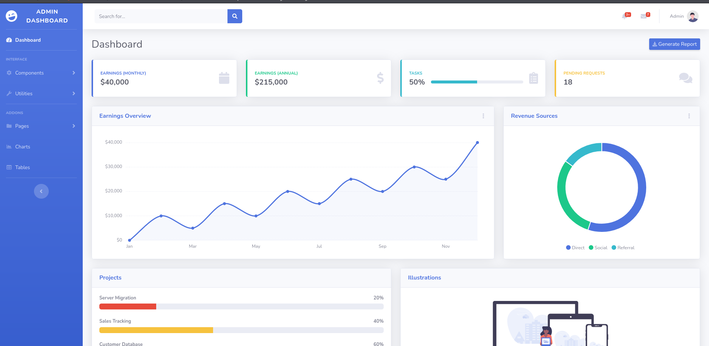
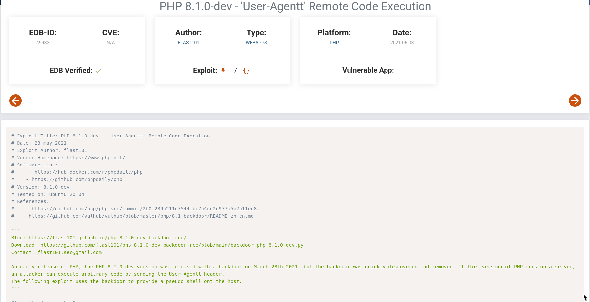
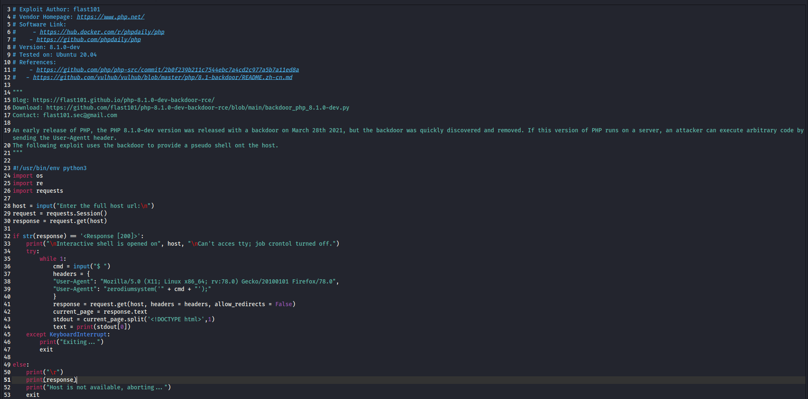
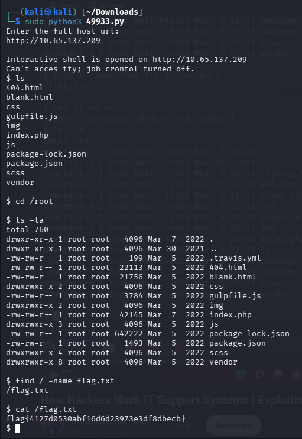

# Agent T
*Try hack me - challenges*

## 1. Overview
There is something wrong with the server and you need to try and access it and find out the flag

## 2. Learning Objectives
- Using nmap scans to find out the version of a website
- Searching up exploits

## 3. Tools Used
- Nmap
- Python

## 4. Reconnaissance & Initial Observations
- I got the target machines ip address and did a basic nmap scan of the address:



- From this scan I could determine that the php version was ```PHP 8.1.0-dev```
- I also saw that port 80 was open so I then went to their website:



- I saw that there was no need to login as they already gave me acces to the admmin page however all the buttons were for decoration and none of them actually took in any input.

## 5. Execution
- I then decided to see if I could find any exploits online for the specific version of the website which I did:



- I downloaded it and veiwed the code:



- I then ran the code and gave it the host url and it then gave me access:



- I then ran the ```ls``` command to see if I could see any files that could potentially have the flag in it.
- I also ran the ```ls -la``` command to veiw all of the hidden files as well.
- I ended up just using the command ```find / -name flag.txt``` to search for any .txt flag files and one did come up.
- I then displayed its contents and found the flag.

## 6. Key Findings
- Having an outdated service version allowed me to use an exploit to gain access to unauthorised files.

## 7. Conclusion
In conclusion, this was a challenge that made me realise the importance of using public sources and information to help you gain access to any old services that are still running on websites, and how easy it is to use exploits against them and gain access.

