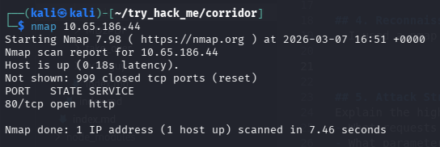
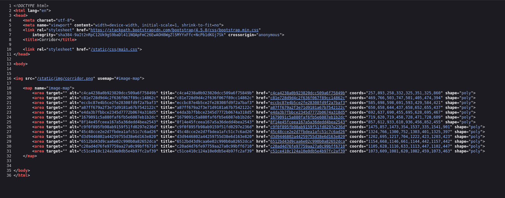
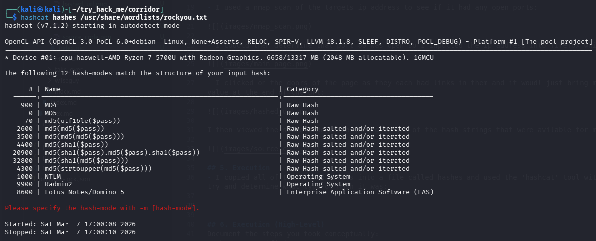
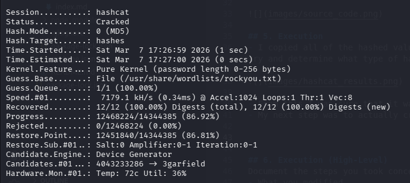
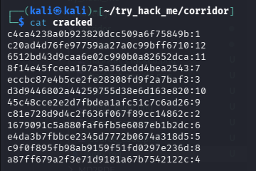
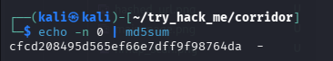
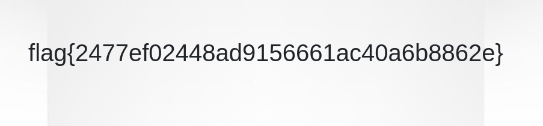

# Corridor
*Try hack me - challenges*

## 1. Overview
- It helps you explore potential IDOR vulnerabilities and has hashed hexadecimal in the different rooms which you then need to find out what type of hash it is and see if you can get into any other rooms.

## 2. Learning Objectives
- How to find out a hash type
- viewing the source code (ctrl u) to find out more information
- Being able to use that hash type to see if you can find the flag

## 3. Tools Used
- hashcat
- md5sum
- rockyou.txt
- nmap

## 4. Reconnaissance & Initial Observations
- I used a nmap scan of the targets ip address to see if it had any open ports:

- I coudld then determine that port 80 was open so I inputted the ip address into firefox which then gave me this page:

- I clicked on the doors of the page as they each had links in them and it woudl just bring me to a blank page with a hashed value at the end of the url:

I then viewed the soure code which showed me all of the hash strings that were avilable for me to see:

## 5. Execution
- I copied all of the hashed values into a file called hashes and used the 'hashcat' tool with the rockyou.txt wordlist to try and determine what type of hash it was:

- From this I was sure that it was an md5 hash
- My next step was to actually crack the hashes, once again using hashcat:

- I saved the output into a cracked file where we could see the unhashed values and it ended up being numbers:

- I thought to then try and input a different hashed number at the end of the url to see if I could veiw anything different:

- using the md5sum tool, I found out the hashed version of 0
- I tried entering that into the endpoint of the url and found the flag:

## 6. Conclusion
Overall, this was a very fun lab as it enbled me to learn about different types of hashes and on how to use the tool hashcat to help automate the process.

