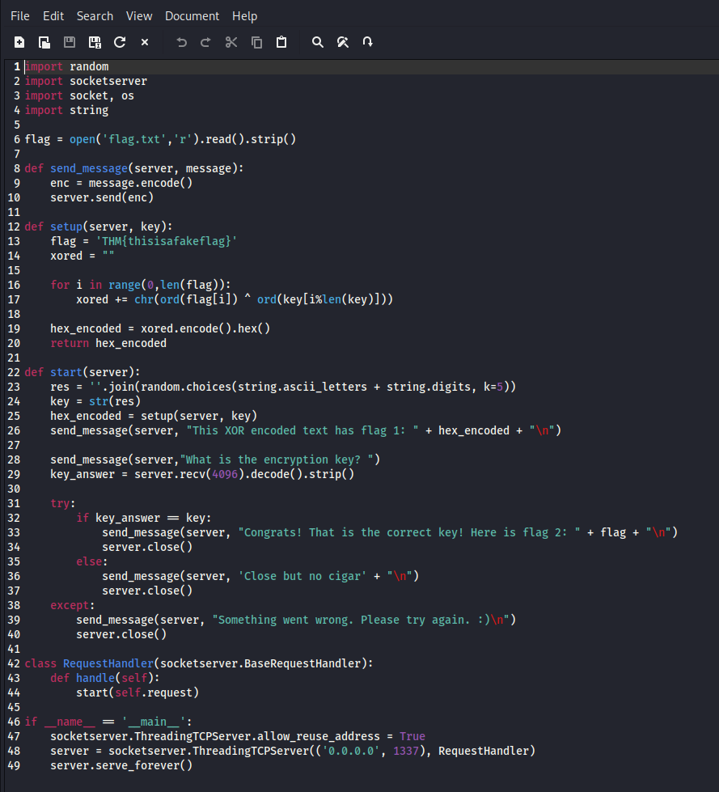
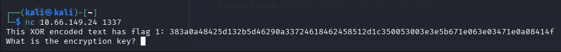
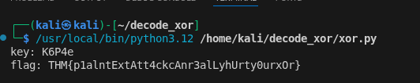
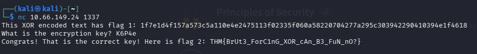

# W1seguy
*Try hack me - challenges*

## 1. Overview
- The main goal of this excersize is to find the 2 flags however when you find them we can see that they are both encrypted using an xor encryption and encoded in hex, our aim is to decrypt them and find the encryption key.

## 2. Learning Objectives
- Understand what xor encryption is
- Recognise xor encrypted data
- Create a scrpit to automate xor encryption

## 3. Tools Used
- Python
- Netcat

## 4. Reconnaissance & Initial Observations
- We can download the task file that the lab gives us to have a look at the source code:



- Looking at the source code we can see how the piece of code ```join(random.choices(string.ascii_letters + string.digits, k=5))``` shows us how the key is 5 characters long and is a combination of uppercase/lowercase letters and digits.

- The lab also gave us this piece of information:


- I then connected port 1337 via netcat which then gave us the first flag but in an encrypted form:



- This also confirms that it is xor encoded

## 5. Execution
- My next step was to make a script to help decode the flag as well as find out the encryption key:

```python
import string
from pwn import *

charset = string.ascii_letters + string.digits
enc_flag = bytes.fromhex('1f7e1d4f157a573c5a110e4e2475113f02335f060a58220704277a295c303942290410394e1f4618')
part_flag = b'THM{'

part_key = xor(enc_flag, part_flag)[:4]

# print(part_key)

for c in charset:
    key = part_key + c.encode()
    dec_flag = xor(enc_flag, key).decode()

    if dec_flag[-1] == '}':
        print(f"key: {key.decode()}")
        print(f"flag: {dec_flag}")
```
### 5.1 Explanation of script
```import string```
- Imports Python’s string module, which contains useful character sets like letters and digits.

```from pwn import *```
- Import everything from the pwntools library but we are specifically using it for the xor() function.

```charset = string.ascii_letters + string.digits```
Creates a string containing:

- all lowercase letters

- all uppercase letters

- all digits

This will be used to brute‑force a missing key character.

```enc_flag = bytes.fromhex('1f7e1d4f157a573c5a110e4e2475113f02335f060a58220704277a295c303942290410394e1f4618')```
- This converts the long hex string into raw bytes.
- This is my XOR‑encrypted flag.

```part_flag = b'THM{'```
- This is our known plaintext

```part_key = xor(enc_flag, part_flag)[:4]```
- This is the key step:

- XOR the encrypted flag with the known plaintext (THM{})

- This reveals the first 4 bytes of the key

- [:4] keeps only those 4 bytes

This works because XOR is reversible:
cipher⊕plaintext=key

So now I have the first 4 bytes of the key.

```# print(part_key)```
- Commented out - would show the partial key if needed

```for c in charset:```
- Loops through every possible character (A–Z, a–z, 0–9).
- This brute‑forces the 5th byte of the key.

```key = part_key + c.encode()```
- Builds a 5‑byte key by adding the guessed character to the known first 4 bytes.

```dec_flag = xor(enc_flag, key).decode()```
- Decrypts the entire encrypted flag using the guessed key.
- Then decodes it into a string.

```if dec_flag[-1] == '}':```
- Checks whether the decrypted flag ends with }.
- Most flags always end with }, so this is a smart validity check to make sure it's decrypted it correct.
- If the decrypted text ends with }, the key is probably correct.

### 5.2 Result of script

- I ran the script and the result was:



- This both decrypted the first flag and gave me the decryption key
- I then copied the key into the port i connected to and it then gave me the second flag:



## 6. Conclusion
- Overall I really enjoyed this lab as it was my first look at cryptography and it enabled me to learn how to write a basic automation script to find out the key and decode the flag for me.

