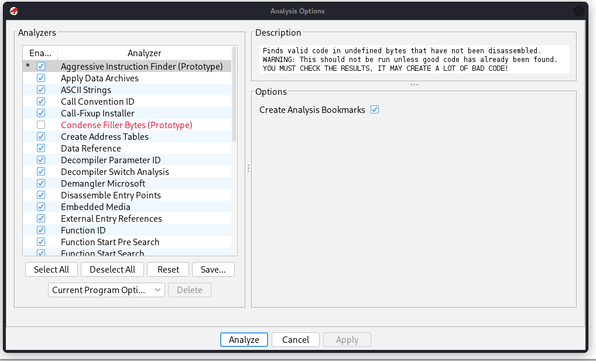
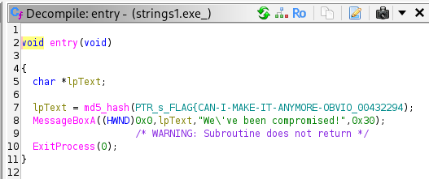
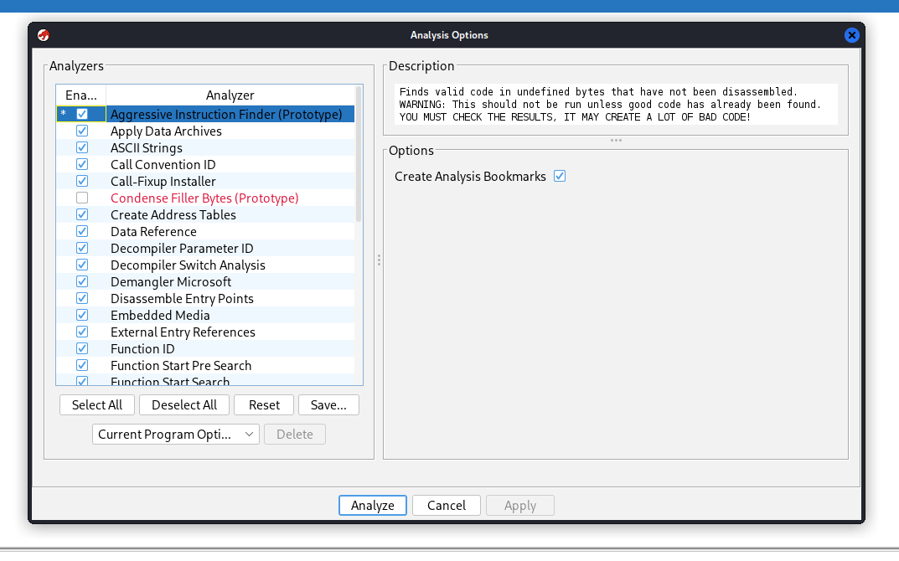
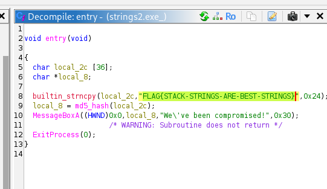
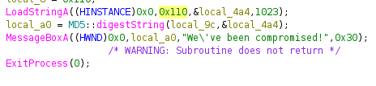
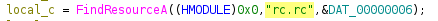
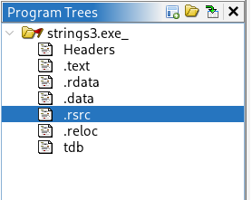
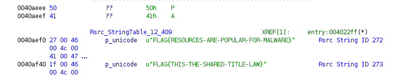

# Basic Malware RE

## 1. Strings::Challenge 1
- The purpose:
    To identify the plaintext flag hidden inside the binary using only static analysis without executing the program
- When run, it prints an MD5 hash.

---

## 2. Basic Info
- File type: PE32 executable (Windows)

- Architecture: x86

- Stripped: Yes

- Hashes: md5

---

## 3. Static Analysis
- I downloaded the zip file and extracted the exe from it.
- As it wasn't an elf file I just loaded up ghidra and opened the exe in there.
- I then analysed the file

- I clicked on the entry function and could then view all the data.

- After the automatic debugger it enabled me to find the flag.

---

## 5. Core Logic
- It made the flag and md5 hash equivalent to a variable.
- It had 3 main functions: Entry, FUN and md5_hash
---

## 6. Result
- The program simply prints a precomputed MD5 hash. It does not compute the hash at runtime — the plaintext flag is stored separately inside the binary.

- By inspecting the binary statically (via Ghidra), the plaintext flag becomes visible:
FLAG{CAN-I-MAKE-IT-ANYMORE-OBVIOUS}

---

## 7. Notes
- Issues encountered:  
None — the binary is intentionally simple. The only potential confusion is that the MD5 hash printed at runtime is not needed to solve the challenge.

## Strings::Challenge 2

---

## 1. Purpose

- To identify the plaintext flag stored inside the binary using static analysis.

- The program computes an MD5 hash of a hardcoded string and displays it in a Windows message box.

- The goal is to recover the original flag string without relying on dynamic execution.

---

## 2. Basic Info

- File type: PE32 executable (Windows)

- Architecture: x86

- Stripped: Yes

- Hashes: md5

---

## 3. Static Analysis

- I extracted the executable from the challenge ZIP.

- Loaded the binary into Ghidra for static analysis.

- Allowed Ghidra to run its analyzers.

- Navigated to the entry function where the main logic resides.

---

## 4.Key Findings

- The binary contains a hardcoded flag string inside a stack buffer.

- The program copies the flag into local_2c using builtin_strncpy.

---

## 5. Core Logic
- Important functions:

- entry

- builtin_strncpy

- md5_hash

- MessageBoxA

---

## 6. Result

- The plaintext flag is embedded directly in the binary:

- FLAG{STACK-STRINGS-ARE-BEST-STRINGS}

- The MD5 hash shown at runtime is irrelevant for solving the challenge.

## 7. Notes

- No issues encountered.

- This challenge demonstrates how stack‑allocated strings are often used in simple malware samples.

- Static analysis alone is sufficient — no debugging required.

## Strings::Challenge3

---

## 1. Purpose

- To locate flags stored inside the resource section of a Windows PE file.

- The challenge teaches how malware often hides configuration strings, commands, or markers inside .rsrc.

---

## 2. Basic Info

- File type: PE32 executable (Windows)

- Architecture: x86

- Stripped: Yes

- Hashes: md5

## 3. Static Analysis

- uploaded the binary into Ghidra.

- Opened the Entry function to view the main code and converted some hexadecimal values into decimal.

- I saw there was a rc.rc part within the main code even though I didn't install any .rc files.

- I Opened the Program Trees window to inspect PE sections.

- The .rsrc section contained multiple string tables.

- These string tables included Unicode‑encoded flags.

- I matched the decimal value I saw at the start to a .rc ID which gave me the correct flag.

## 4. Key Findings

- Flags stored as UTF‑16 strings.

- Multiple flags present, but only one is the challenge flag.

## 5. Notes

- This challenge demonstrates how malware hides configuration data in PE resources.

- I learnt that:

- .rsrc is a common place for:

        - C2 URLs

        - Encryption keys

        - Flags

        Version info

- Ghidra’s resource viewer makes extraction a lot easier..