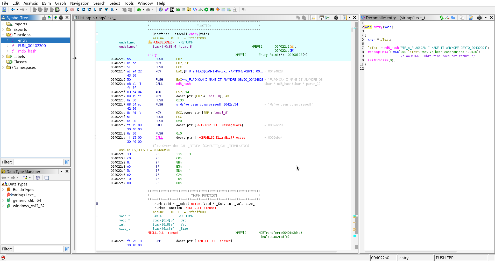

# Basic Malware RE

## 1. Strings::Challenge 1
- The purpose:
    To identify the plaintext flag hidden inside the binary using only static analysis without executing the program
- When run, it prints an MD5 hash.

---

## 2. Basic Info
- File type: PE32 executable (Windows)

- Architecture: x86

- Stripped: Yes

- Hashes: md5

---

## 3. Static Analysis
- I downloaded the zip file and extracted the exe from it.
- As it wasn't an elf file I just loaded up ghidra and opened the exe in there.
- I then analysed the file

- I clicked on the entry function and could then view all the data.

- After the automatic debugger it enabled me to find the flag.

---

## 5. Core Logic
- It made the flag and md5 hash equivalent to a variable.
- It had 3 main functions: Entry, FUN and md5_hash
---

## 6. Result
- The program simply prints a precomputed MD5 hash. It does not compute the hash at runtime — the plaintext flag is stored separately inside the binary.

- By inspecting the binary statically (via Ghidra), the plaintext flag becomes visible:
FLAG{CAN-I-MAKE-IT-ANYMORE-OBVIOUS}

---

## 7. Notes
- Issues encountered:  
None — the binary is intentionally simple. The only potential confusion is that the MD5 hash printed at runtime is not needed to solve the challenge.
