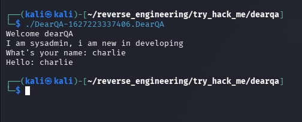
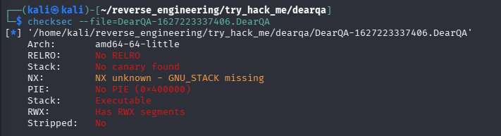
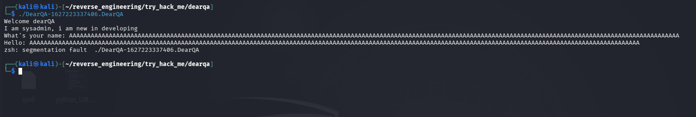
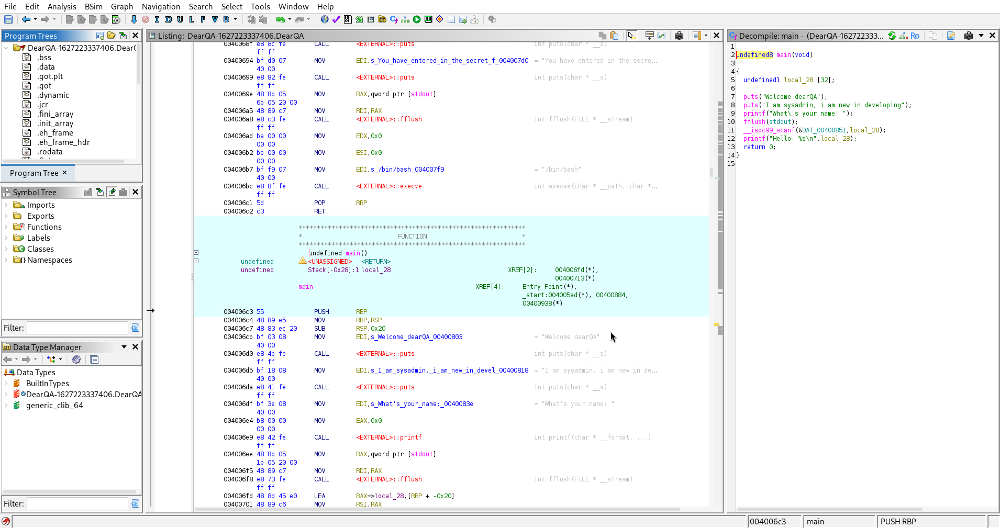

# Dear QA

## 1. Summary
- Purpose of analysis: To identify whether the DearQA binary contains a memory corruption vulnerability and determine if it can be exploited to gain a reverse shell through a port.

- What the binary appears to do: It prints a welcome message, asks for the user’s name, and then echoes it back.

- Final conclusion: The binary contains a classic stack‑based buffer overflow due to an unsafe iso_scanf call, allowing control of RIP and therefore redirection to the vuln() function to gain access to a reverse shell by the vuln() function calling /bin/bash.

---

## 2. Basic Info
- File type: ELF 64‑bit LSB executable

- Architecture: x86_64

- Stripped: No

---

## 3. Static Analysis
- I first ran the file command on the binary to see the architecture and what type the file was.

- I then just ran the actual file which prints a hello message, asks for the user name then echoes it back.



- After I also ran the ```checksec``` command allowing me to see if the binary was vulnerable to anything.



- We can see that there are no stack canaries which are used to detect a stack buffer overflow before execution of malicious code can occur

- The binary also has no PIE, which means they have fixed memory adresses making it easier to exploit.

- I tested the buffer overflow protection by inputting a large amount of characters which you can see below leads to a segmentation fault.



- I then opened up the file in ghidra to try and find any intresting patterns or information and went straight to the main() function.




- Noteable Imports: iso_scanf, printf
- Notable functions: Main, Vuln
- Suspicious Patterns: Use of iso_scanf("%s", buffer) with no length restriction
Stack variable at offset -0x28 (40 bytes)
No stack canaries
No PIE (static addresses → easier exploitation)

---

## 4. Dynamic Analysis
- Execution behaviour
- Syscalls (strace)
- Library calls (ltrace)
- Debugger notes (breakpoints, register changes)

---

## 5. Core Logic
- Key algorithm or check
- Important variables
- Pseudocode snippet

---

## 6. Result
- What the binary actually does
- Crackme solution / malware behaviour summary

---

## 7. Notes
- Issues encountered
- Things to revisit
- Lessons learned
