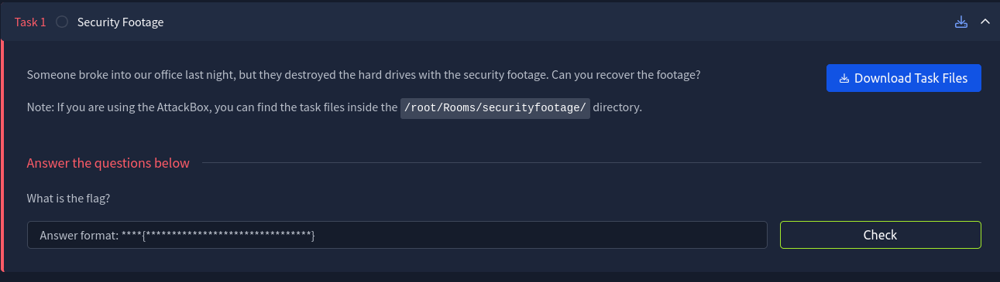
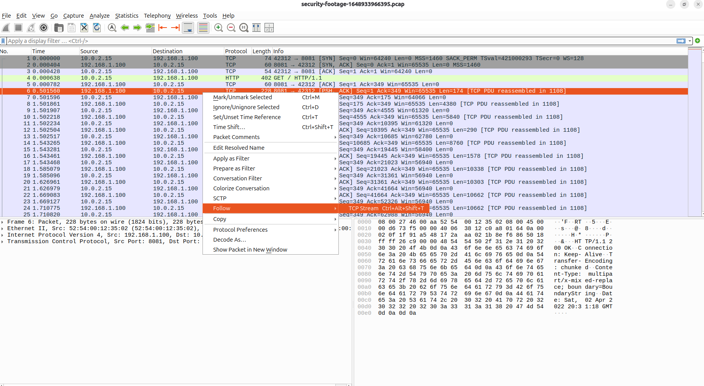
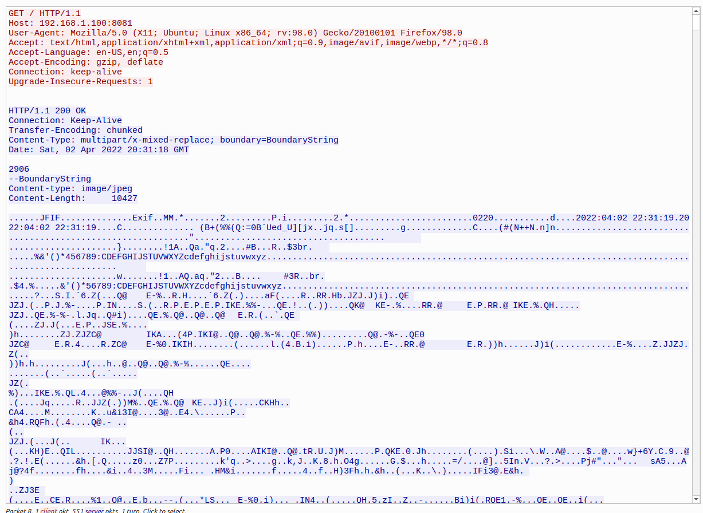
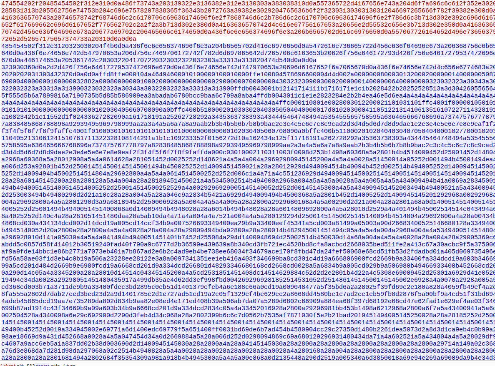
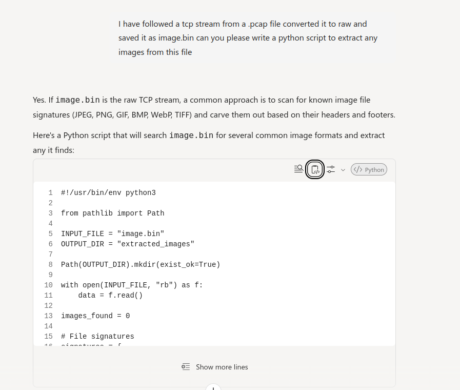
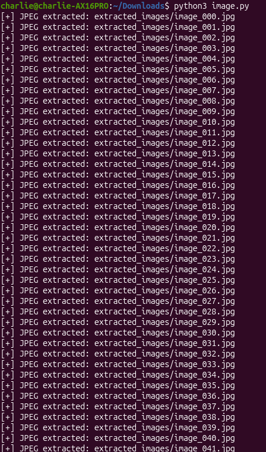
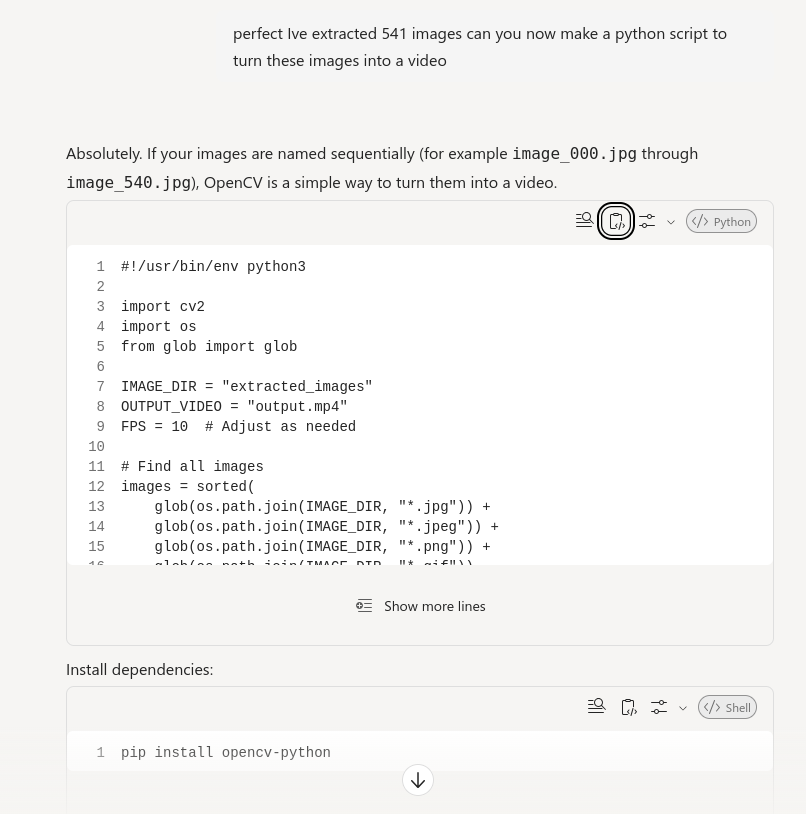
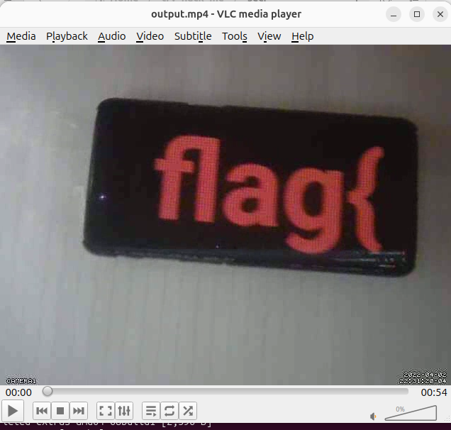

# Security Footage
*TryHackMe - Reverse Engineering / Network Forensics*

---

## 1. Overview
- **Room Name**: Security Footage
- **Category**: Reverse Engineering / Network Forensics
- **Objective**: Recover and reconstruct a corrupted or fragmented security video stream captured in a network packet capture (`.pcap`) to retrieve the hidden flag.

---

## 2. Lab Details & Tools Used
- **File Analyzed**: Packet Capture (`.pcap`) & Extracted Binary Data (`.bin`)
- **Tools**:
  - **Wireshark / Network Packet Analyzer**: For packet inspection and TCP stream reconstruction.
  - **Python 3**: For binary stream manipulation, raw image reconstruction, and video assembly.

---

## 3. Network Analysis & PCAP Extraction
### 3.1 Inspecting the Capture

1. I downloaded the challenge `.pcap` file and opened it in Wireshark.



2. I first filtered through packet traffic to identify anything interesting I could see.

3. I did see a http packet but after closer inspection it turned out to be nothing, and all the rest were TCP packets. 

### 3.2 Following the TCP Stream

1. I located a relevant TCP packet and used the in built Wireshark tool to follow the stream.

2. After I right-clicked the packet and selected **Follow -> TCP Stream**.





3. Changed the display format from ASCII to **Raw** to capture the unmodified byte stream.



4. I then saved the raw payload as `image.bin`

---

## 4. Frame Reconstruction (Script 1: Binary to Images)
### 4.1 Script Development

1. For this script I used copilot to help make the script to extract the images.

- Below is the prompt I used and image of the result including the conversion script.

`I have followed a tcp stream from a .pcap file converted it to raw and saved it as image.bin can you please write a python script to extract any images from this file`



```python
#!/usr/bin/env python3

from pathlib import Path

INPUT_FILE = "image.bin"
OUTPUT_DIR = "extracted_images"

Path(OUTPUT_DIR).mkdir(exist_ok=True)

with open(INPUT_FILE, "rb") as f:
    data = f.read()

images_found = 0

# File signatures
signatures = {
    "jpg": {
        "start": b"\xFF\xD8\xFF",
        "end": b"\xFF\xD9"
    },
    "png": {
        "start": b"\x89PNG\r\n\x1a\n",
        "end": b"IEND\xaeB`\x82"
    },
    "gif": {
        "start": [b"GIF87a", b"GIF89a"],
        "end": b"\x00\x3B"
    },
    "bmp": {
        "start": b"BM"
    }
}

# Extract JPEGs
offset = 0
while True:
    start = data.find(signatures["jpg"]["start"], offset)
    if start == -1:
        break

    end = data.find(signatures["jpg"]["end"], start)
    if end == -1:
        break

    end += 2

    filename = f"{OUTPUT_DIR}/image_{images_found:03d}.jpg"
    with open(filename, "wb") as out:
        out.write(data[start:end])

    print(f"[+] JPEG extracted: {filename}")
    images_found += 1
    offset = end

# Extract PNGs
offset = 0
while True:
    start = data.find(signatures["png"]["start"], offset)
    if start == -1:
        break

    end = data.find(signatures["png"]["end"], start)
    if end == -1:
        break

    end += len(signatures["png"]["end"])

    filename = f"{OUTPUT_DIR}/image_{images_found:03d}.png"
    with open(filename, "wb") as out:
        out.write(data[start:end])

    print(f"[+] PNG extracted: {filename}")
    images_found += 1
    offset = end

# Extract GIFs
offset = 0
while True:
    start = -1

    for sig in signatures["gif"]["start"]:
        pos = data.find(sig, offset)
        if pos != -1 and (start == -1 or pos < start):
            start = pos

    if start == -1:
        break

    end = data.find(signatures["gif"]["end"], start)
    if end == -1:
        break

    end += 2

    filename = f"{OUTPUT_DIR}/image_{images_found:03d}.gif"
    with open(filename, "wb") as out:
        out.write(data[start:end])

    print(f"[+] GIF extracted: {filename}")
    images_found += 1
    offset = end

print(f"\nDone. Extracted {images_found} image(s).")
```


### 4.3 Output

- I then tried to run this script however it didn't seem to work but I then realised I just didn't save it to the same folder so I then re-ran the script and everything worked!



- The script successfully split the binary into individual frame sequences.

---

## 5. Video Assembly (Script 2: Images to Video)
### 5.1 Script Development

1. After this I went back to copilot to ask it to generate me a new script that takes all of these collected images and ties them all together to make a video.



### 5.2 Output & Playback
- I tried to play the generated .mp4 file however I had no way of viewing this so had to install vlc media player to be able to view it.

---

## 6. Results 

- **Analysis**:
  - The security footage revealed the timestamped video recording containing the flag text.



---

## 7. Notes & Lessons Learned
- **Key Takeaways**:
  - Following and exporting raw TCP streams is an effective way to extract unencrypted multimedia payloads.
  - Scripting custom binary parsers in Python enables very quick recovery of non-standard or fragmented data.

### 7.1 Conclusion

- In conclusion I really enjoyed this room and it gave a very good feeling of satisfaction when managing to extract images and then a video from raw TCP data. It helped educate me about different tools in wireshark and certain packets to look out for, I would definitely recommend this room.
