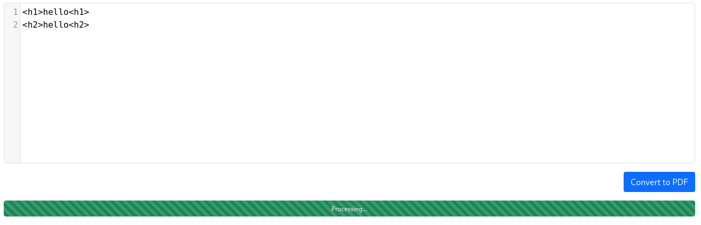

# MD2PDF 

## Overview
A brief summary of the room:
- difficulty - easy
- Skills used (command injection, Directory enumaration)
- Objective - find the flag

---
## 1. Exploring the Web Application
- MD2PDF is a website that can convert any text you enter in there into a pdf document
- The only main suspicion was the user input field

### 1.1 Enumeration
- Tools used `nmap`, `gobuster`
- I used nmap to discover that port 80 was open
- I then used gobuster to find any directories that were there:
```
gobuster dir -u http://10.66.129.194/ -w /usr/share/wordlists/dirbuster/directory-list-2.3-medium.txt 
===============================================================
Gobuster v3.8.2
by OJ Reeves (@TheColonial) & Christian Mehlmauer (@firefart)
===============================================================
[+] Url:                     http://10.66.129.194/
[+] Method:                  GET
[+] Threads:                 10
[+] Wordlist:                /usr/share/wordlists/dirbuster/directory-list-2.3-medium.txt
[+] Negative Status codes:   404
[+] User Agent:              gobuster/3.8.2
[+] Timeout:                 10s
===============================================================
Starting gobuster in directory enumeration mode
===============================================================
admin                (Status: 403) [Size: 166]
Progress: 1094 / 220559 (0.50%)
```
- I found an admin directory so I tried it:


- However unfortunately it was forbidden and could only be accessed on localhost port 5000

---

## 2. Injection Analysis

### 2.1 Understanding if html injection would work
- I tested some html code in the user input box:



- I then pressed the convert to pdf button to see if it would work and it did:


--- 

## 3. Exploitation

### 3.1 Crafting html injection code
- I used iframe as I wanted to be able to embed the local host page within the main website
- The injection I inputted was ```<iframe src="http://localhost:5000/admin"></iframe>```
- I then converted it into a pdf and got the output of:


---

## 4. Conclusion
- I learnt how i could quickly test if html injection was possible
- this vulnerability matters as you could end up doing a lot worse than just doing an iframe
- It was a good room to test your knowledge of how you can do html injection
