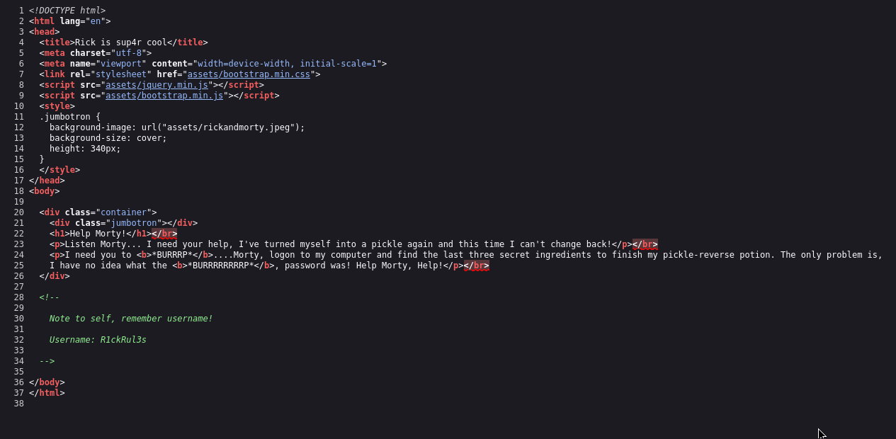
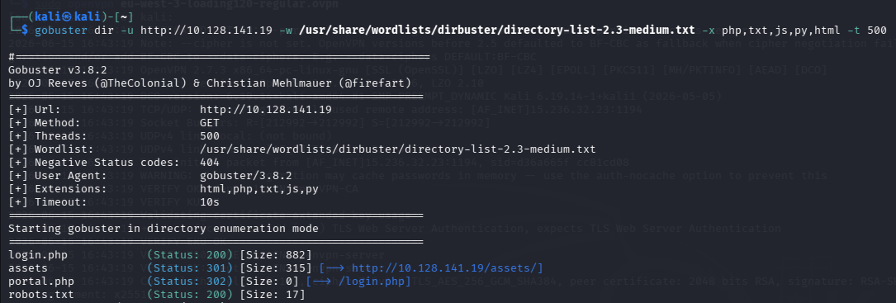
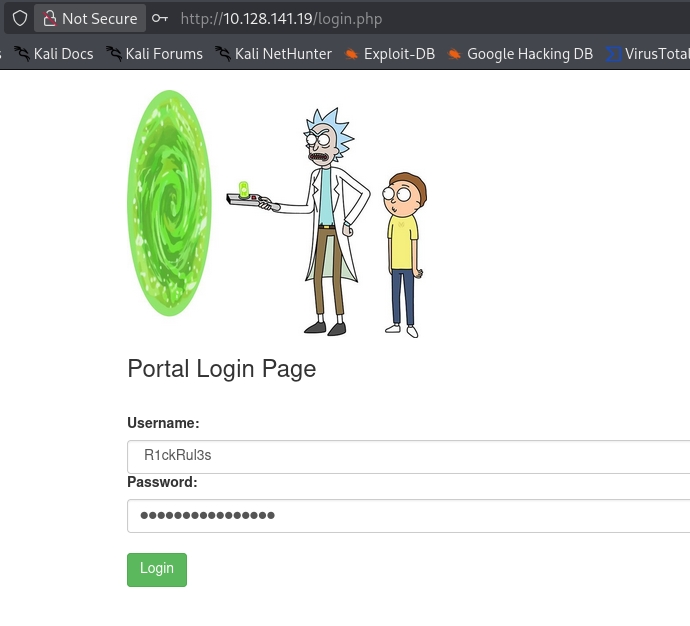
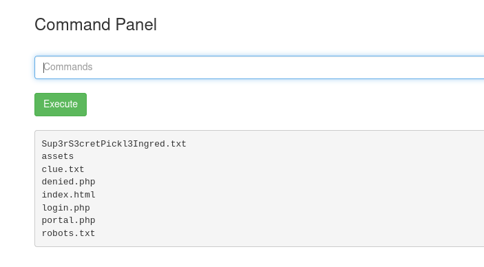
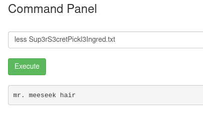
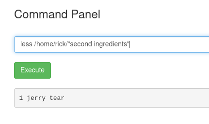
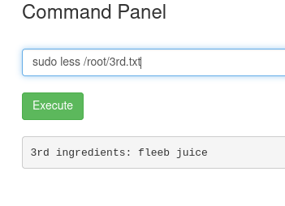

# Room/Challenge Name

## 1. Goal
- Gain access to the web server 
- Enumarate the machine to find hidden directories and credentials
- Escalate priveleges to root
- Find all 3 flags

---

## 2. What I Learned
- Web/directory enumeration
- Command injection through a vulnerable web form
- Simple privilege escalation 

---

## 3. Key Observations
- The homepage source code contained a username hint.

- A hidden file (robots.txt and others) revealed password clues.

- A web form allowed arbitrary command execution on the server.

- The user account had limited permissions, requiring enumeration to find the final flag.

- The root flag was stored in /root, requiring privilege escalation.

---

## 4. Commands / Scripts Used
```
# gobuster dir -u http://10.128.141.19 -w /usr/share/wordlists/dirbuster/directory-list-2.3-medium.txt -x php,txt,js,py,html -t 500

```
- This is used to find various directories connected to the main web page

```

# Using the command panel in the web interface
ls
less <filename>
pwd
sudo -l
sudo ls
sudo less
ls /

```

---

## 5. Screenshots

- I went to the main web page and viewed the source code which had a note to self to remember the username.


- I used gobuster to find multiple directories connected to the main web page and went to robots.txt which seemed to give me the password


- I then went to the login page and entered the found username and password and it worked and logged me in


- The site then gave us a command panel where we could use simple commands like ls


- It turns out the command 'cat' wouldn't work so I eventually found out that 'less' would, giving me the first ingredient


- I did some digging around the filesystem and found the second ingredient


- I used sudo to get to the root directory and found the 3rd and final ingredient.
---

## 6. Mistakes & Fixes (Optional)
- Using cat as the only method to try and display files - I looked at more commands to display information 

---

## 7. Summary
- This room went well and reinforced the idea that directory enumeration is extremely important as well as good knowledge on privilege escalation and a variety of commands for different scenarios if one command doesn't work but overall a very fun challenge.
